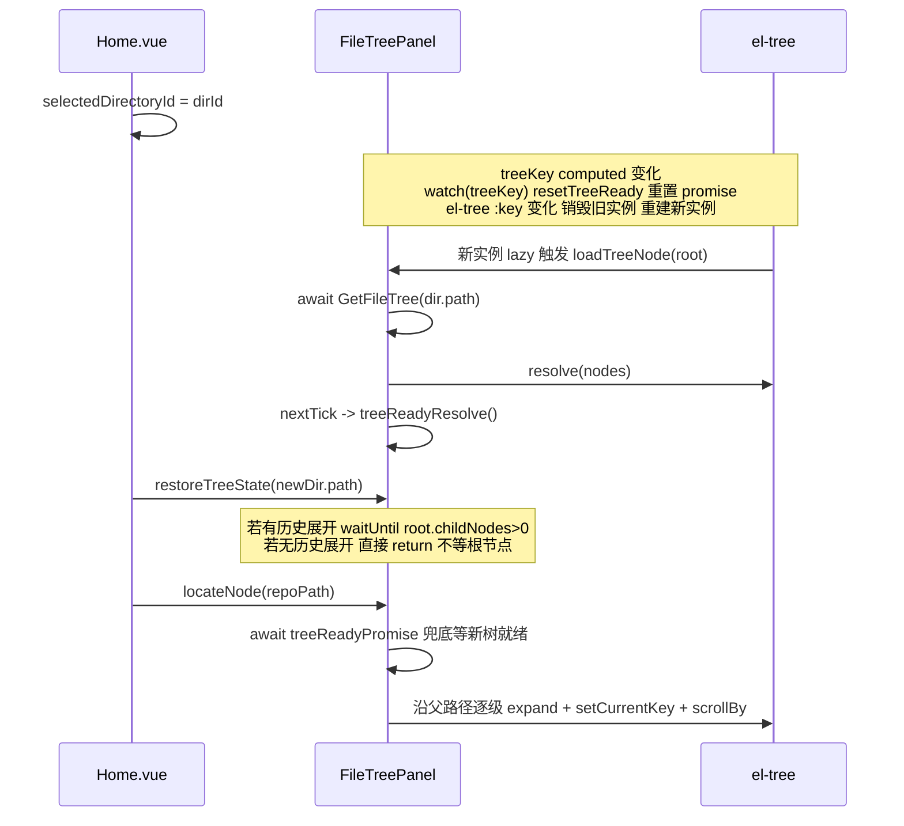

# Research: 跨工作目录跳转的文件树展开衔接实现

- **Query**: 仓库筛选器弹窗点击"跳转"后，跨工作目录展开文件树到目标仓库节点的衔接方案
- **Scope**: internal（基于现有代码 Home.vue / FileTreePanel.vue / DirectoryTree.vue）
- **Date**: 2026-07-19

## Findings

### 关键文件

| File Path | Description |
|---|---|
| `frontend/src/views/Home.vue` | 顶层编排：持有 `selectedDirectoryId`、`fileTreePanelRef`，已有 `onDirectorySelect` / `onPaletteSelectFile` 跨目录跳转雏形 |
| `frontend/src/components/FileTreePanel.vue` | 文件树：`locateNode`（1283 行）、`loadTreeNode`（472 行）、`treeReadyPromise`（393 行）、`defineExpose`（1346 行） |
| `frontend/src/components/DirectoryTree.vue` | 左栏工作目录列表：`@select` emit dirId（194 行 `handleSelect`） |
| `.trellis/tasks/07-19-repo-filter-dialog/prd.md` | 需求文档：F11（132 行）与跳转实现（226-228 行）已明确"复用 locateNode、跨工作目录先切换再定位" |

### 联动链路：DirectoryTree -> Home -> FileTreePanel

1. `DirectoryTree.vue` 点击工作目录条目 -> `handleSelect(dirId)` -> `emit('select', dirId)`（194-196 行）。
2. `Home.vue` 模板 `@select="onDirectorySelect"`（17 行）接收。`onDirectorySelect`（229-264 行）做四件事：
   - 保存当前目录树状态：`fileTreePanelRef.value?.saveCurrentState(currentDir.path)`（234 行）。
   - 同步置 `selectedDirectoryId.value = dirId`（246 行），并按 `newDir.isGitRepo` 一次性算出 `selectedNode`（249-257 行，避免 ContentPanel 卸载再挂载双刷新）。
   - `await nextTick()`（260 行）等 Vue patch 完成。
   - `fileTreePanelRef.value?.restoreTreeState(newDir.path)`（262 行）恢复目标目录历史展开。
3. `FileTreePanel.vue` 通过 `props.selectedDirId` 接收（377 行），驱动 `treeKey = computed(() => ${selectedDirId}_${refreshCounter})`（391 行）。

### 文件树重建时序（treeKey / treeReadyPromise）

`FileTreePanel.vue` 关键机制：

- `el-tree` 模板带 `v-if="selectedDirId"` + `:key="treeKey"`（12-13 行）。`selectedDirId` 或 `refreshCounter` 变化 -> `treeKey` 变 -> el-tree 实例销毁重建。
- `treeReadyPromise` 是模块级 `let` 变量（393-394 行），`watch(treeKey, () => resetTreeReady())`（400-402 行）在 key 变化时重置为新 promise。
- `loadTreeNode`（472-512 行）在根节点（level 0）加载完成、`resolve(processedNodes)` 后，`nextTick(() => treeReadyResolve?.())`（504-506 行）resolve 当前 promise。
- `locateNode` 首行 `await treeReadyPromise`（1284 行）兜底等待"当前 treeKey 对应的根节点已加载"。

时序（跨工作目录切换）：



### 现有跨工作目录跳转实现（命令面板，可复用范式）

`Home.vue` 的 `onPaletteSelectFile`（371-382 行）/ `onPaletteSelectFavorite`（384-395 行）已是同款场景：

```js
// Home.vue:371-382（现状，未 await onDirectorySelect）
function onPaletteSelectFile(item) {
  recordAccess({ path: item.path, type: item.type, workDir: currentDirPath.value })
  if (item.path.startsWith(currentDirPath.value)) {
    fileTreePanelRef.value?.locateNode(item.path)
  } else {
    const targetDir = directories.value.find(d => item.path.startsWith(d.path))
    if (targetDir) {
      onDirectorySelect(targetDir.id)
      nextTick(() => fileTreePanelRef.value?.locateNode(item.path))
    }
  }
}
```

可工作但有两处可改进：
1. `onDirectorySelect` 未 `await`，`restoreTreeState`（恢复历史展开）与 `locateNode`（展开目标 + 选中 + 滚动）并发，可能竞争同一批节点的 expand/loadData。
2. 路径比较 `item.path.startsWith(d.path)` 用原始字符串，未规范化分隔符与大小写。

### 跨工作目录跳转衔接方案

**结论：不需要给 FileTreePanel 暴露新方法。** 现有 `locateNode` 已 `defineExpose`（1361 行），内部 `await treeReadyPromise` 兜底等待新工作目录树就绪。编排逻辑放在 `Home.vue` 层（因为 `selectedDirId` 是 Home 持有的 ref，只有 Home 能切换）。

**推荐时序**（相较命令面板的改进点：`await onDirectorySelect` 让历史展开恢复先完成，再 locateNode；路径比较前置规范化）：

1. 规范化 `repoPath` 与各 `dir.path`（分隔符统一 `/` + `toLowerCase`），查找 `targetDir`。
2. 尽早关闭弹窗（`repoFilterVisible.value = false`），避免弹窗遮挡文件树。
3. 若 `targetDir.id !== selectedDirectoryId.value`：`await onDirectorySelect(targetDir.id)` 触发切换（treeKey 变 -> treeReadyPromise 重置 -> el-tree 重建 -> 根节点加载 -> resolve）。
4. `await fileTreePanelRef.value?.locateNode(repoPath)`：内部 `await treeReadyPromise` 兜底等新树就绪，再沿父路径逐级展开 + `setCurrentKey` 选中 + `scrollBy` 滚动。
5. 同工作目录：跳过步骤 3，treeKey 不变、treeReadyPromise 不重置（旧 promise 早已 resolve），`locateNode` 立即执行。

**关于 `await onDirectorySelect` 的可靠性**：`onDirectorySelect` 内 `restoreTreeState` 在无历史展开时（`state.expandedPaths.length === 0`，1216 行）提前 return，不等根节点加载。因此 `await onDirectorySelect` 返回时树未必就绪。这恰好由 `locateNode` 内 `await treeReadyPromise` 兜底覆盖，方案稳健。

### 路径匹配分析

`locateNode` 内部规范化逻辑（1292-1296 行）：

```js
const sep = rootPath.includes('\\') ? '\\' : '/'
const normalizedTarget = sep === '\\' ? targetPath.replace(/\//g, '\\') : targetPath.replace(/\\/g, '/')
const normalizedRoot = sep === '\\' ? rootPath.replace(/\//g, '\\') : rootPath.replace(/\\/g, '/')
if (!normalizedTarget.startsWith(normalizedRoot)) return
```

- 分隔符：已按 rootPath 的 sep 统一，够用。
- **大小写：未处理**。`startsWith` 区分大小写。Windows 文件系统不区分大小写，若 `repoPath` 盘符或路径段大小写与 `dir.path` 不一致（如 `D:\` vs `d:\`），`startsWith` 失败 -> `locateNode` 直接 return，跳转静默失败。
- PRD F13（134 行）已约定后端用 `filepath.Abs` 规范化路径主键，与 `DirectoryService` 一致。`filepath.Abs` 在 Windows 下返回 `\` 分隔但不改大小写。因此**前端查找 targetDir 时必须自己 toLowerCase 比较**，不能裸用 `startsWith`。

### 推荐方案代码骨架

**FileTreePanel.vue：无需改动。** `locateNode` 已暴露且自带 `await treeReadyPromise` 兜底。

**Home.vue 新增跳转编排方法**（供 RepoFilterDialog 通过 `@locate` emit 调用）：

```js
// ---- 仓库筛选器：跳转定位（跨工作目录衔接）----
const onRepoLocate = async (repoPath) => {
  if (!repoPath) return

  // 1. 规范化比较，定位目标所属工作目录（规避 \ / 与大小写差异）
  const norm = (p) => (p || '').replace(/\\/g, '/').toLowerCase()
  const normTarget = norm(repoPath)
  const targetDir = directories.value.find(d => normTarget.startsWith(norm(d.path)))
  if (!targetDir) {
    ElMessage.warning('未找到该仓库所属的工作目录')
    return
  }

  // 2. 尽早关闭弹窗，避免遮挡文件树
  repoFilterVisible.value = false

  // 3. 跨工作目录：先切换（触发 treeKey 变化 -> treeReadyPromise 重置 -> el-tree 重建）
  //    await 让 restoreTreeState（历史展开恢复）先完成，再 locateNode，避免并发竞争 expand
  if (targetDir.id !== selectedDirectoryId.value) {
    await onDirectorySelect(targetDir.id)
  }

  // 4. 定位：locateNode 内部 await treeReadyPromise 兜底等新树就绪，
  //    再沿父路径逐级 expand + setCurrentKey + scrollBy
  await fileTreePanelRef.value?.locateNode(repoPath)
}
```

**Home.vue 模板接入**（RepoFilterDialog.vue 尚未创建，implement 时按此接线）：

```html
<RepoFilterDialog
  v-model:visible="repoFilterVisible"
  :directories="directories"
  :current-dir-id="selectedDirectoryId"
  @locate="onRepoLocate"
/>
```

**RepoFilterDialog.vue 跳转按钮**（implement 时）：

```js
const emit = defineEmits(['locate', /* ... */])
const onJumpClick = (repo) => {
  emit('locate', repo.path)  // 仅传路径，切换/等待/定位/关弹窗由 Home 编排
}
```

### 完整时序（文字描述）

**同工作目录跳转**：
1. RepoFilterDialog emit('locate', repoPath)。
2. Home `onRepoLocate`：规范化查找 targetDir，命中当前 `selectedDirectoryId`。
3. 关闭弹窗。
4. `await locateNode(repoPath)`：`await treeReadyPromise`（旧 promise 已 resolve，立即过）-> 沿父路径逐级 `node.expand()` + `waitForNodeLoaded` -> `tree.setCurrentKey` -> `scrollBy`。

**跨工作目录跳转**：
1. RepoFilterDialog emit('locate', repoPath)。
2. Home `onRepoLocate`：规范化查找 targetDir，与当前 `selectedDirectoryId` 不同。
3. 关闭弹窗。
4. `await onDirectorySelect(targetDir.id)`：保存旧树状态 -> `selectedDirectoryId = dirId` -> `treeKey` 变 -> `watch(treeKey)` 重置 `treeReadyPromise` -> el-tree `:key` 变化销毁重建 -> 新实例 lazy 触发 `loadTreeNode(root)` -> `await GetFileTree` -> `resolve(nodes)` + `nextTick(treeReadyResolve)` -> `restoreTreeState`（恢复历史展开）。
5. `await locateNode(repoPath)`：`await treeReadyPromise`（等新树根节点就绪）-> 沿父路径逐级展开 + 选中 + 滚动。

## Caveats / Not Found

1. **大小写匹配风险**：`locateNode` 内 `normalizedTarget.startsWith(normalizedRoot)` 未处理大小写，Windows 下盘符/路径段大小写不一致会静默 return。方案骨架中前端查找 targetDir 已 `toLowerCase`，但 `locateNode` 内部校验仍是裸 `startsWith`。若后端 `GetRepoFilterList` 返回的 `repoPath` 与 `dir.path` 同源（均经 `filepath.Abs`），实际大小写一致，风险低；若不同源，需在 implement 时确认或增强 `locateNode` 的 toLowerCase。
2. **`treeReadyPromise` 未暴露**：该变量是 FileTreePanel 模块级 `let`（393 行），未通过 `defineExpose` 暴露。外部无法直接 `await`，只能通过 `locateNode` 间接触发等待。当前方案无需暴露；若后续有"等树就绪但不定位"的需求，可额外暴露 `waitTreeReady()` 方法（可选增强，非必须）。
3. **`await onDirectorySelect` 不保证树就绪**：`restoreTreeState` 在无历史展开时提前 return（1216 行），`await onDirectorySelect` 返回时根节点可能未加载完。方案靠 `locateNode` 内 `await treeReadyPromise` 兜底，已覆盖此场景。
4. **RepoFilterDialog.vue 尚未创建**：本研究基于 prd.md 需求与现有代码给出接入点方案，组件实现属后续 implement 范畴。`repoFilterVisible` ref、模板接线、emit 协议均为建议，implement 时按实际组件设计落地。
5. **并发竞争（已规避）**：采用 `await onDirectorySelect` 而非命令面板现有的 `nextTick(() => locateNode())`，使 `restoreTreeState`（历史展开）与 `locateNode`（目标展开 + 选中 + 滚动）串行，避免二者并发触发同一节点的 expand/loadData 竞争。命令面板的旧实现可后续按同一范式优化（非本任务范围）。
