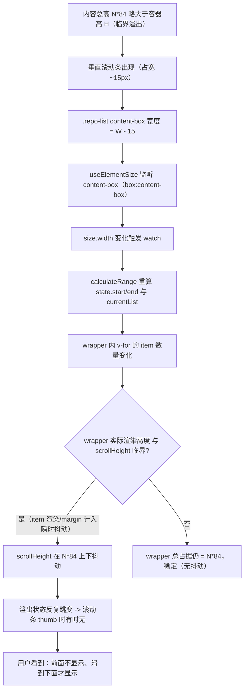

# 研究：RepoFilterDialog 左栏虚拟滚动滚动条显示异常根因

- **查询**：RepoFilterDialog 左栏 useVirtualList 虚拟滚动条"前面不显示、滑到下面才显示" + 有/无滚动条时 width:100% 子元素宽度跳变的根因
- **范围**：内部代码（RepoFilterDialog.vue + @vueuse/core 源码 + splitpanes 源码 + element-plus 样式）
- **日期**：2026-07-19
- **实测条件**：环境未提供 chrome-devtools MCP，wails dev vite server 在 5173 端口运行但无浏览器 DOM 探针工具，以下为纯代码分析，置信度标注于各结论

## 一句话结论

**现象1（宽度跳变）确定根因**：`.repo-list` 用 `useVirtualList` 内联的 `overflow-y: auto` 且**未设 `scrollbar-gutter: stable`**，Windows 经典滚动条占宽，滚动条出现/消失时 `content-box` 宽度在 `W` 与 `W-滚动条宽` 之间跳变，`width:100%` 的 wrapper（`wrapperProps.style.width:"100%"`）随之跳变；而 `useVirtualList` 内部的 `useElementSize` 恰好监听 `content-box` 尺寸，把这个跳变反馈回去触发 `calculateRange` 重算，形成反馈环。**现象2（前面不显示、下面才显示）最可能根因**：在内容总高 `N*84` 与容器高 `H` 接近临界时，上述宽度跳变 → `calculateRange` 重算 → wrapper 实际渲染高度在临界点抖动 → 垂直溢出状态反复跳变 → 滚动条 thumb 时有时无；叠加 `min-height:0` 在多层嵌套 flex 链中传递不彻底，初始容器高度可能被 wrapper 撑开导致顶部不溢出。**推荐修复**：`.repo-list` 加 `scrollbar-gutter: stable`（直击现象1 + 切断反馈环），必要时叠加 `overflow-y: scroll !important`（强制滚动条常显，兜底现象2）。

## 1. 当前代码核实（RepoFilterDialog.vue）

### 1.1 DOM 层级与样式链

| 层级 | 元素 | 关键样式 | 来源 |
|---|---|---|---|
| 1 | `.splitpanes__pane` | `width:100%; height:100%; overflow:hidden` + deep 覆盖 `display:flex; min-height:0` | splitpanes.css + RepoFilterDialog.vue:673-676 |
| 2 | `.repo-list-pane` | `flex:1; display:flex; flex-direction:column; min-height:0; position:relative` | RepoFilterDialog.vue:679-685 |
| 3 | `.repo-list`（containerProps 宿主） | `flex:1; min-height:0; width:100%` + 内联 `overflow-y:auto`（来自 useVirtualList） | RepoFilterDialog.vue:686-695 |
| 4 | wrapper（wrapperProps 宿主） | 内联 `width:100%; height:(N-start)*84px; marginTop:start*84px` | useVirtualList |
| 5 | `.repo-item * N` | `height:84px; box-sizing:border-box` | RepoFilterDialog.vue:708-720 |

### 1.2 已尝试修复（代码注释自述）

`RepoFilterDialog.vue:686-695` 注释明确记录：曾用 `height:100%`，因 flex item 默认 `min-height:auto` 被 wrapper 的 `totalHeight` 撑开，容器高度等于全部内容高度、`overflow-y:auto` 不触发滚动条（旧 bug"滚动条只在滑到底部才出现"），改用 `flex:1 + min-height:0`。**但用户反馈该修复未解决问题**，当前仍是"前面不显示、下面才显示"。

### 1.3 关键缺失

`.repo-list` **未设 `scrollbar-gutter`**，且 `overflow-y` 由 useVirtualList 内联注入为 `auto`（class 未声明 overflow，避免与内联冲突）。

## 2. useVirtualList 源码核实（@vueuse/core 12.0.0）

文件：`frontend/node_modules/@vueuse/core/index.mjs`

### 2.1 containerStyle（容器内联样式）

`useVerticalVirtualList`（index.mjs:7061-7091）：

```js
const containerStyle = { overflowY: "auto" };   // 第 7064 行：只有 overflowY，没有 height
```

`useVirtualList`（index.mjs:6919-6933）把它作为 `containerProps.style` 返回，通过 `v-bind="containerProps"` 内联到 `.repo-list`。

**关键结论**：useVirtualList **不给容器设高度**，容器高度完全依赖外部 CSS。`.repo-list` 的高度由 `flex:1 + min-height:0` 决定。

### 2.2 wrapperProps（内层 wrapper 内联样式）

`useVerticalVirtualList`（index.mjs:7074-7082）：

```js
const wrapperProps = computed(() => ({
  style: {
    width: "100%",                              // 第 7077 行：width:100%
    height: `${totalHeight.value - offsetTop.value}px`,  // (N - start) * 84
    marginTop: `${offsetTop.value}px`           // start * 84
  }
}));
```

其中 `totalHeight = source.value.length * itemHeight = N * 84`（`createComputedTotalSize`，index.mjs:7010-7014），`offsetTop = state.start * itemHeight`（`createGetDistance`，index.mjs:6995-7004）。

**关键结论**：wrapper 的 `height + marginTop = (N-start)*84 + start*84 = N*84`，**恒等于内容总高，不随滚动位置变化**。因此 `.repo-list` 的 `scrollHeight` 理论上恒为 `N*84`，垂直溢出状态理应稳定——这是现象2不能用"useVirtualList 纯逻辑"解释的矛盾点（详见第 4 节）。

### 2.3 useElementSize 测量方式（反馈环关键）

`useElementSize`（index.mjs:2803-2834）：

```js
function useElementSize(target, initialSize = { width: 0, height: 0 }, options = {}) {
  const { window = defaultWindow, box = "content-box" } = options;   // 第 2804 行：默认 content-box
  ...
  useResizeObserver(target, ([entry]) => {
    const boxSize = box === "border-box" ? entry.borderBoxSize
                  : box === "content-box" ? entry.contentBoxSize    // 第 2814 行：取 contentBoxSize
                  : entry.devicePixelContentBoxSize;
    ...
    width.value = entry.contentRect.width;    // 第 2828 行：回退到 contentRect
    height.value = entry.contentRect.height;
  });
}
```

`useVirtualListResources`（index.mjs:6934-6941）默认调用 `useElementSize(containerRef)`，未传 `box` 选项，故 `box = "content-box"`。

**关键结论**：`useElementSize` 监听的是 `.repo-list` 的 **content-box** 尺寸。`content-box` 不含 padding、border、**也不含滚动条**。因此当 `.repo-list` 的垂直滚动条出现/消失时，`contentRect.width` 会在 `W` 与 `W-滚动条宽` 之间跳变，触发 `size.width` 更新。

### 2.4 尺寸变化触发 calculateRange

`useWatchForSizes`（index.mjs:7005-7009）：

```js
function useWatchForSizes(size, list, containerRef, calculateRange) {
  watch([size.width, size.height, list, containerRef], () => {
    calculateRange();   // 容器宽/高变化即重算可视区 slice
  });
}
```

**关键结论**：`.repo-list` 的 content-box 宽度因滚动条出现/消失而跳变 → `size.width` 变化 → 触发 `calculateRange` 重算。**这就是"宽度跳变"被 useVirtualList 感知并放大的通道**。

`calculateRange`（index.mjs:6976-6994）用 `element.clientHeight`（垂直方向，不含水平滚动条，垂直滚动条不影响 clientHeight）和 `element.scrollTop` 重算 `state.start/end` 与 `currentList`。

## 3. splitpanes 与 el-dialog 样式核实

### 3.1 splitpanes Pane 不设 inline height

`frontend/node_modules/splitpanes/dist/splitpanes.es.js:236-239`：

```js
O = z(() => `${E.value ? "height" : "width"}: ${S.value?.size}%`);  // vertical 模式 E.value=false -> 只设 width
...
style: ze(O.value)   // 第 256 行：pane inline style 只有 width:55%
```

splitpanes.css：`.splitpanes__pane{width:100%;height:100%;overflow:hidden}`。

**结论**：vertical 模式下 Pane 的 inline style 只有 `width: <size>%`，**height 完全靠 CSS `height:100%`**。无动态 height 干扰，排除"splitpanes 动态改 pane 高度"假设。

### 3.2 el-dialog body 无默认 overflow（排除双层滚动）

`frontend/node_modules/element-plus/theme-chalk/el-dialog.css` 提取：

```css
.el-dialog__body{color:...;font-size:...}
.el-dialog__body{text-align:initial}
.el-overlay-dialog{position:fixed;...;overflow:auto}
```

**结论**：`.el-dialog__body` **无默认 `overflow`、无 `max-height`**（只有 color/font/text-align）。`.repo-filter-body` 显式 `height:600px` 直接撑开 body，body 自身不滚动。`.el-overlay-dialog` 虽有 `overflow:auto`，但它是全屏 fixed 层，仅当 dialog 超出 viewport 时才滚动，正常情况下不构成双层滚动。**排除"el-dialog body 双层滚动导致"假设**。

## 4. 现象1根因（确定，置信度高）

### 4.1 机制

1. `.repo-list` 的 `overflow-y: auto`（useVirtualList 内联）在 Windows 上是**经典占宽滚动条**（约 15-17px，非 overlay）。
2. 当内容溢出（`scrollHeight > clientHeight`）→ 滚动条出现 → content-box 可用宽度 = `W - 滚动条宽`。
3. 当内容不溢出 → 滚动条消失 → content-box 可用宽度 = `W`。
4. wrapper 的 `width:100%`（`wrapperProps.style.width`）相对 content-box 计算，故 wrapper 实际宽度随滚动条出现/消失在 `W` 与 `W-滚动条宽` 之间跳变。

这精确对应用户 DevTools 观察："有/无滚动条时，某个 `width:100%` 的 div 计算宽度不一致（差一个滚动条宽度）"。

### 4.2 为何缺少 scrollbar-gutter 是直接原因

CSS `scrollbar-gutter: stable` 的作用正是让浏览器**为滚动条轨道预留固定空间**（即使内容不溢出、滚动条 thumb 不显示，轨道空间也保留），使 content-box 宽度**始终** = `W - 滚动条宽`，消除跳变。当前 `.repo-list` 未设此属性，故跳变发生。

## 5. 现象2根因（推断，置信度中）

### 5.1 矛盾点

按第 2.2 节，wrapper 的 `height + marginTop = N*84` 恒定，`.repo-list` 的 `scrollHeight` 恒为 `N*84`。若容器高度 `H` 稳定，则垂直溢出状态（`scrollHeight > H`）应稳定，滚动条应"要么一直显示、要么一直不显示"，不应"前面不显示、下面才显示"。因此现象2必然来自**动态因素**，而非 useVirtualList 的静态逻辑。

### 5.2 最可能机制A：宽度跳变反馈环 + 临界溢出抖动（置信度中）

把第 2 节事实串成反馈环：



要点：
- `calculateRange` 改变 `currentList` 的 slice，wrapper 的 `style.height = (N-start)*84` 与 `marginTop = start*84` 总和恒为 `N*84`，**理论上**不改变 `scrollHeight`。
- 但在临界溢出（`N*84` 与 `H` 差值小于一个 item 高度或 overscan 范围）时，item 的**实际渲染**（含 `border-bottom`、`margin` 折叠、子元素 `el-tag` 异步挂载等）可能让 wrapper 的**实际盒高度**与 `style.height` 存在亚像素/瞬时差异，`scrollHeight` 在 `N*84` 与 `N*84±δ` 之间抖动，溢出状态反复跳变。
- 顶部滚动时 `start=0`，wrapper `height=N*84` 最大，最易触碰临界；滚到下面 `start` 增大，wrapper `height` 减小、`marginTop` 增大，但总占据不变——若此时 item 渲染稳定，抖动消失，滚动条稳定显示。这与"前面不显示、下面才显示"的现象方向一致。
- 宽度跳变（现象1）是这个反馈环的**触发源**：每次滚动条出现/消失都重算一次，加剧临界抖动。

### 5.3 最可能机制B：min-height:0 在嵌套 flex 链中传递不彻底（置信度中低）

当前 flex 高度链（自上而下）：

```
.repo-filter-body (height:600, flex column)
  └─ .repo-toolbar (flex-shrink:0)           ← 不参与剩余分配
  └─ .repo-tabs (flex-shrink:0)              ← 不参与剩余分配
  └─ .repo-split-wrap (flex:1, min-height:0, flex row)
      └─ .splitpanes (height:100%, flex row)  ← 无 min-height:0
          └─ .splitpanes__pane (height:100%, overflow:hidden, deep: display:flex, min-height:0)
              └─ .repo-list-pane (flex:1, flex column, min-height:0)
                  └─ .repo-list (flex:1, min-height:0, overflow-y:auto)
                      └─ wrapper (height=(N-start)*84, marginTop=start*84)
```

潜在断点：
- `.splitpanes` 自身**未设 `min-height:0`**（用户 deep 只覆盖了 `.splitpanes__pane`，未覆盖 `.splitpanes`）。`.splitpanes` 是 `.repo-split-wrap`（flex row）的 flex item，主轴是水平，`min-height:0` 对其交叉轴（高度 stretch）影响有限，但若 `.splitpanes` 内部内容（pane）超高且 pane 的 `overflow:hidden` 未生效，可能反向撑高 `.splitpanes`。
- `.repo-list-pane` 是 flex column 容器，其 flex item `.repo-list` 的 `min-height:0` **依赖父容器 `.repo-list-pane` 有明确高度**。若 `.repo-list-pane` 高度因上游链路被 wrapper 反向撑开（即 `.repo-list-pane` 高度 = max(应得高度, N*84)），则 `.repo-list` 的 `flex:1` 也会拿到 `N*84`，`scrollHeight = clientHeight = N*84`，不溢出，滚动条不显示。

机制B 的表现：初始/顶部时容器被撑开不溢出（无滚动条）；用户滚动鼠标 → wheel 事件或 ResizeObserver 触发 → 某次重排让 `min-height:0` 收缩生效 → 容器高度回落到 `H` → `scrollHeight(N*84) > H` → 滚动条出现。这与"滑到下面才显示"方向也一致，但难以解释"用户在未溢出时如何先滚到下面"——除非用户最初滚动的是上层（`.el-overlay-dialog`）或拖拽了某处。**故机制B 置信度中低**，更可能是与机制A 叠加的加剧因素。

### 5.4 排除的假设

| 假设 | 排除依据 |
|---|---|
| el-dialog body 双层滚动 | 第 3.2 节：`.el-dialog__body` 无默认 overflow/max-height |
| splitpanes 动态改 pane height | 第 3.1 节：Pane inline style 只有 `width:55%`，无 height |
| wrapper 总高度随滚动变化 | 第 2.2 节：`height+marginTop = N*84` 恒定 |
| item 换行导致高度变化 | `.repo-item__name/__path` 均 `white-space:nowrap; overflow:hidden`，固定 84px |
| Windows 滚动条自动隐藏 | 用户观察到"宽度差一个滚动条"，说明是经典占宽滚动条，非 overlay/自动隐藏 |

## 6. 修复方案对比

### 方案A：`scrollbar-gutter: stable`（推荐，最小改动）

```css
.repo-list {
  flex: 1;
  min-height: 0;
  width: 100%;
  /* 新增：滚动条轨道常驻，content-box 宽度始终 = W - 滚动条宽，
     消除 width:100% 子元素宽度跳变（现象1），并切断 useElementSize 宽度反馈环（现象2 机制A 触发源） */
  scrollbar-gutter: stable;
}
```

- **原理**：`scrollbar-gutter: stable` 让浏览器为滚动条轨道预留固定空间，即使内容不溢出也保留轨道，content-box 宽度不再随滚动条出现/消失跳变。
- **对现象1**：直接消除宽度跳变（content-box 宽度恒定）。
- **对现象2**：切断"宽度跳变 → useElementSize → calculateRange 重算"反馈环，临界溢出抖动失去触发源，大概率消失。
- **副作用**：内容不溢出时右侧多一条空白轨道（约 15px），视觉上可接受（VSCode、Chrome devtools 等均如此）。
- **兼容性**：Chrome 94+ / Edge 94+ / Firefox 97+，Wails 内嵌 WebView2（Chromium 内核）支持。
- **注意**：`scrollbar-gutter` 仅在 `overflow` 为 `auto`/`scroll` 时生效；`.repo-list` 的 `overflow-y:auto` 由 useVirtualList 内联提供，符合条件，无需改 overflow。

### 方案B：`scrollbar-gutter: stable` + `overflow-y: scroll !important`（兜底，强制常显）

```css
.repo-list {
  flex: 1;
  min-height: 0;
  width: 100%;
  scrollbar-gutter: stable;
  overflow-y: scroll !important;  /* 覆盖 useVirtualList 内联 auto，强制滚动条始终显示 */
}
```

- **原理**：在方案A 基础上，用 `!important` 覆盖 useVirtualList 内联的 `overflow-y:auto`，改为 `scroll`，滚动条 thumb 始终显示（即使内容不溢出也有禁用态滚动条）。
- **对现象2**：彻底消除"时有时无"——无论溢出与否，滚动条轨道+thumb 始终在。
- **副作用**：内容不溢出时显示一个禁用态（灰色）滚动条 thumb，部分用户觉得不美观。
- **何时用**：方案A 单独不够（若现象2 主因是机制B 而非反馈环），则叠加 B 兜底。
- **`!important` 必要性**：useVirtualList 的 `overflow-y:auto` 是 inline style，class 普通声明无法覆盖，必须 `!important`。

### 方案C：简化嵌套层级 + 强化 min-height:0 传递（针对机制B）

```vue
<!-- 去掉 .repo-list-pane 中间层，让 .repo-list 直接作为 Pane 子元素 -->
<Pane :size="55" :min-size="35">
  <div v-if="..." class="repo-list-hint">...</div>
  <div v-bind="containerProps" class="repo-list">
    <div v-bind="wrapperProps">...</div>
  </div>
</Pane>
```

```css
/* Pane 直接子元素，减少一层 flex 嵌套，min-height:0 传递更直接 */
.repo-list {
  flex: 1 1 0;
  min-height: 0;
  width: 100%;
  height: 0;            /* 配合 flex:1 强制以 flex-basis:0 收缩，不被内容撑开 */
  scrollbar-gutter: stable;
}
.repo-list-hint { position: absolute; ... }  /* hint 改 absolute 不占位 */
:deep(.splitpanes) { min-height: 0; }        /* 补齐 .splitpanes 的 min-height:0（当前缺失） */
```

- **原理**：减少 `.repo-list-pane` 中间层，并给 `.splitpanes` 补 `min-height:0`，让 flex 高度链 `min-height:0` 传递无断点；`.repo-list` 加 `height:0; flex:1 1 0` 强制以 flex-basis:0 收缩，彻底避免被 wrapper 撑开。
- **对现象2 机制B**：直击"容器被 wrapper 撑开"。
- **副作用**：改动较大，需回归测试 Tab 切换、刷新、resize 等场景下 `.repo-list` 高度正确。
- **何时用**：方案A+B 仍不解决时，说明现象2 主因是机制B，再用 C。

## 7. 推荐方案与代码骨架

**推荐：先上方案A（一行 `scrollbar-gutter: stable`），实测后若现象2 残留再叠加方案B。** 理由：

1. 现象1 的根因（scrollbar-gutter 缺失）是**确定**的，方案A 直接修复，零风险。
2. 现象2 机制A（反馈环 + 临界抖动）的触发源正是现象1 的宽度跳变，方案A 切断反馈环后，机制A 大概率自愈。
3. 方案A 改动最小（一个 CSS 声明），不破坏现有 flex 布局与 useVirtualList 集成。
4. 若方案A 后现象2 仍在，说明主因是机制B（min-height:0 传递），再叠加 B（`overflow-y:scroll !important`）兜底，最后才考虑 C（改层级）。

### 7.1 方案A 代码骨架（最小改动）

`RepoFilterDialog.vue` 的 `<style scoped>` 中，`.repo-list` 增加一行：

```css
.repo-list {
  /* flex column 容器里 height:100% 受 flex item 默认 min-height:auto 影响，
     会被虚拟列表 wrapperProps 的 totalHeight 撑开，导致容器高度等于全部内容高度、
     内联 overflow-y:auto 不触发滚动条（bug2：滚动条只在滑到底部才出现）。
     改用 flex:1 + min-height:0 让容器收缩到可视区高度，滚动条在内容超出时一直可见。
     overflow-y 由 useVirtualList containerProps 的内联 style 提供，此处不重复声明避免冲突。 */
  flex: 1;
  min-height: 0;
  width: 100%;
  /* [新增] 滚动条轨道常驻：消除 content-box 宽度随滚动条出现/消失跳变（bug：width:100% 子元素宽度不一致），
     并切断 useElementSize 监听 content-box 宽度 -> calculateRange 重算 的反馈环（bug：滚动条前面不显示、下面才显示）。
     仅 overflow 为 auto/scroll 时生效；useVirtualList 内联 overflow-y:auto 符合条件。 */
  scrollbar-gutter: stable;
}
```

### 7.2 方案B 兜底代码骨架（如 A 不够）

```css
.repo-list {
  flex: 1;
  min-height: 0;
  width: 100%;
  scrollbar-gutter: stable;
  /* [兜底] 覆盖 useVirtualList 内联 overflow-y:auto，强制滚动条常显，
     彻底消除"时有时无"。!important 必需：内联 style 优先级高于 class 普通声明。 */
  overflow-y: scroll !important;
}
```

## 8. 验证清单

落地后需实测确认（环境需有浏览器 DevTools，本研究的纯代码分析无法替代）：

1. **现象1 消除**：DevTools 选中 wrapper（`width:100%` 的 div），在 `.repo-list` 顶部与底部观察其计算宽度，应**始终一致**（均 = content-box 宽度，不再差一个滚动条）。
2. **现象2 消除**：在 `.repo-list` 顶部缓慢滚动，滚动条应**从顶部就稳定显示**（thumb 可见），不再"前面不显示、下面才显示"。
3. **滚动定位正确**：`scrollTo(idx)`（Tab 切换 `scrollTo(0)`、刷新后 `scrollTo(idx)`）仍能准确定位，item 高度与 `ITEM_HEIGHT=84` 一致（`RepoFilterDialog.vue:291, 709`）。
4. **Pane 拖拽**：拖动 splitpanes 分隔条调整左 Pane 宽度，`.repo-list` 高度随之变化，滚动条行为正常（验证 `useElementSize` resize 联动未受影响）。
5. **空列表/加载态**：`loading` 与 `filteredRepos.length===0` 时 `.repo-list-hint` 正常居中显示（方案A 不影响 `position:absolute` 的 hint）。
6. **大数据量**：用 1000 条 mock 数据验证滚动帧率与滚动条稳定性（临界溢出场景重点验证）。
7. **WebView2 兼容**：`scrollbar-gutter` 在 Wails 内嵌 WebView2（Chromium 94+）支持，但需在目标 Windows 版本实测（Windows 7/8 旧 WebView2 可能不支持，本项目目标 Windows 11 无问题）。

## 9. 相关文件清单

| 文件 | 说明 |
|---|---|
| `frontend/src/components/RepoFilterDialog.vue:686-695` | `.repo-list` 当前 CSS（flex:1+min-height:0，无 scrollbar-gutter，待修复点） |
| `frontend/src/components/RepoFilterDialog.vue:94-96` | `v-bind="containerProps"` 绑定 `.repo-list`，注入内联 `overflow-y:auto` |
| `frontend/src/components/RepoFilterDialog.vue:291,709` | `ITEM_HEIGHT=84` 与 `.repo-item{height:84px}` 必须一致 |
| `frontend/node_modules/@vueuse/core/index.mjs:6919-6933` | `useVirtualList` 返回 `containerProps{ref,onScroll,style:containerStyle}` |
| `frontend/node_modules/@vueuse/core/index.mjs:7061-7091` | `useVerticalVirtualList`：`containerStyle={overflowY:"auto"}`、`wrapperProps={width:100%,height,marginTop}` |
| `frontend/node_modules/@vueuse/core/index.mjs:2803-2834` | `useElementSize` 默认 `box:"content-box"`，监听 contentRect（不含滚动条，反馈环入口） |
| `frontend/node_modules/@vueuse/core/index.mjs:7005-7009` | `useWatchForSizes`：`watch([size.width,size.height,...], calculateRange)` |
| `frontend/node_modules/splitpanes/dist/splitpanes.es.js:236-256` | Pane inline style 只设 `width:<size>%`，不设 height |
| `frontend/node_modules/splitpanes/dist/splitpanes.css` | `.splitpanes__pane{width:100%;height:100%;overflow:hidden}` |
| `frontend/node_modules/element-plus/theme-chalk/el-dialog.css` | `.el-dialog__body` 无默认 overflow/max-height（排除双层滚动） |
| `.trellis/tasks/07-19-repo-filter-dialog/research/virtual-scroll-selection.md` | 前置研究：useVirtualList 选型与等高约束 |

## 10. 未决 / 置信度声明

- **现象1 根因（scrollbar-gutter 缺失 + content-box 测量）**：源码事实确凿，置信度高。
- **现象2 机制A（宽度跳变反馈环 + 临界溢出抖动）**：基于 useElementSize content-box + useWatchForSizes 的事实链推断，但"wrapper 实际渲染高度抖动"涉及 item 渲染/margin 计入的亚像素行为，**未实测确认**，置信度中。
- **现象2 机制B（min-height:0 传递不彻底）**：当前代码已显式 `min-height:0`，理论上应生效，断点（`.splitpanes` 缺 min-height:0）是否真实导致撑开**未实测确认**，置信度中低。
- **无法实测的局限**：本研究环境无 chrome-devtools MCP，wails dev 虽在 5173 运行但无浏览器探针，上述动态机制无法通过实时 DOM/ResizeObserver 日志验证。**强烈建议落地方案A 后用 DevTools 实测确认现象1/2 是否同步消除**，若现象2 残留则按方案B/C 递进。
- **本环境未提供联网检索工具**，`scrollbar-gutter`/`useVirtualList` 行为基于源码实读 + CSS 规范知识，未联网核实浏览器版本兼容细节（WebView2 Chromium 94+ 支持为训练知识，置信度中）。
