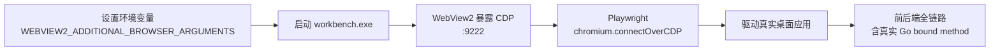
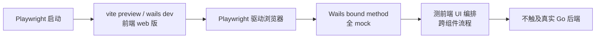
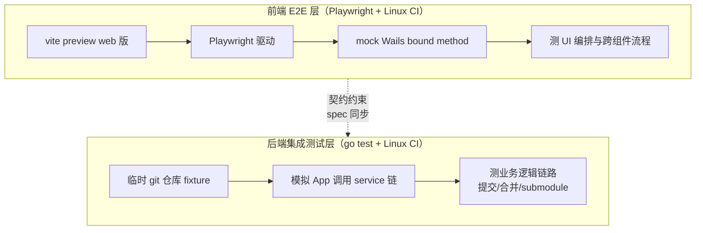

# Research: Wails v2 桌面应用 E2E 测试方案选型

- **Query**: Wails v2 桌面应用（Windows WebView2）的 E2E 测试方案选型——Playwright 可行性 vs Cypress vs Wails 原生 testing vs 其他
- **Scope**: 混合（内部现状核查 + 外部技术调研）
- **Date**: 2026-09-13
- **任务目录**: `.trellis/tasks/09-13-e2e-key-flows/`

---

## 一、项目现状核查（内部）

### 1.1 技术栈与测试基线

| 维度 | 现状 | 来源 |
|---|---|---|
| 桌面框架 | Wails v2.12.0，`outputType: "desktop"` | `wails.json` |
| 前端构建 | Vue3 + Vite，`frontend:dev:serverUrl: "auto"`（Vite dev server，默认端口 34115） | `wails.json` |
| 后端语言 | Go，133 个 Wails bound method | `frontend/wailsjs/go/main/App.js` |
| Wails 绑定 | `frontend/wailsjs/go/main/{App.js, App.d.ts}` + `models.ts` + `runtime/runtime.js` | Glob 结果 |
| 后端测试 | `go test -race` 全绿，model/server ≥80%、service ≥76% | PRD / CLAUDE.md |
| 前端测试 | Vitest + jsdom，47 个 spec 文件，878 用例，≥70% 硬失败 | `frontend/vitest.config.js` + Glob |
| E2E 框架 | 无 | `playwright.config` / `cypress.config` 均无匹配 |

### 1.2 现有 Mock Wails Runtime 模式（关键利好）

`frontend/src/test/setup.js` 已建立全局兜底 mock，组件级 spec 按需覆盖：

```javascript
// setup.js —— 全局兜底
vi.mock('../../wailsjs/go/main/App', () => ({
  GetDirectories: vi.fn(() => Promise.resolve([])),
  PullRepo: vi.fn(() => Promise.resolve('Success')),
  // ... 约 20 个方法的全局默认返回
}))

// GitBranches.spec.js —— 组件级按需覆盖
vi.mock('../../../wailsjs/go/main/App', () => ({
  GetBranches: vi.fn(),
  CreateBranch: vi.fn(),
  DeleteBranch: vi.fn(),
  RenameBranch: vi.fn()
}))
```

**结论**：项目已具备成熟的「mock Wails bound method」基础设施。任何「前端独立 E2E + mock 后端」方案可复用此模式，扩展为 E2E 级 mock 层成本低。

### 1.3 已有组件单测覆盖的 Git 关键流程

| 组件 spec | 覆盖流程 |
|---|---|
| `GitBranches.spec.js` | 分支增删改 |
| `GitMerge.spec.js` | 合并 |
| `GitSubmodules.spec.js` | submodule 管理 |
| `LocalChanges.spec.js` | 提交 |
| `CommitHistory.spec.js` | 提交历史 |
| `FileTreePanel.spec.js` | 文件树操作 |

**注意**：上述为 `mount` 级组件单测（隔离渲染），非全流程 E2E（无路由、无多组件联动、无真实渲染树）。E2E 的增量价值在于「跨组件编排 + 真实渲染 + 用户视角操作链」。

---

## 二、外部技术事实核查

### 2.1 Wails v2 官方 testing 能力

| 项 | 结论 |
|---|---|
| 官方 E2E 框架 | **无**。Wails v2 未提供任何 E2E / 集成测试官方支持 |
| `wails dev` 外部驱动 | `wails dev` 启动 Vite dev server，前端可在浏览器 `localhost:34115` 访问；但此为「web 版」非「桌面 GUI 版」 |
| `wails dev -browser` | 自动打开浏览器查看前端，仍非桌面应用驱动 |
| WebView2 调试端口 | Wails v2 **默认不暴露** WebView2 的 CDP / remote debugging port |
| Wails v3 testing | v3（alpha）引入部分 testing 改进，但 v2.12.0 不适用 |
| 官方文档 E2E 章节 | 无 |

### 2.2 Playwright 驱动 WebView2 的可行性（核心问题）

**结论：技术上可行，但需手动注入调试端口，非开箱即用。**

| 事实 | 说明 |
|---|---|
| WebView2 内核 | 基于 Chromium，支持 CDP（Chrome DevTools Protocol） |
| Playwright 连接方式 | `chromium.connectOverCDP('http://localhost:<port>')` 可连接任意暴露 CDP 的 Chromium 实例 |
| 微软官方支持 | Microsoft Learn 有官方文档「Automate and test WebView2 apps with Microsoft Playwright」，明确支持 Playwright 驱动 WebView2 |
| 暴露调试端口方法 | 环境变量 `WEBVIEW2_ADDITIONAL_BROWSER_ARGUMENTS="--remote-debugging-port=9222"` 传给宿主进程 |
| Wails 适配 | 启动 `workbench.exe` 前设置该环境变量，WebView2 即暴露 CDP，Playwright 可 connect |
| 社区成熟度 | Wails 专项示例稀缺；通用 WebView2 + Playwright 示例由微软提供（Playwright-Lab 仓库） |

### 2.3 Cypress 对 WebView2 / 桌面应用的支持

| 项 | 结论 |
|---|---|
| 驱动 WebView2 桌面应用 | **不支持**。Cypress 仅驱动浏览器，无 CDP connect 能力，无法连接打包后的 Wails GUI |
| 驱动 Vite dev server web 版 | 可行（配置 `baseUrl` 指向 Vite server），但等同「前端独立 E2E」，且相对 Playwright 无优势 |
| 组件测试 | 有 Cypress Component Testing，但项目已用 Vitest，重复投资 |

### 2.4 类似 Wails 桌面应用的 E2E 社区实践

| 项目 | E2E 做法 | 参考价值 |
|---|---|---|
| Tauri 应用 | 官方提供 `tauri-driver`（基于 WebDriver），Wails **无等价物** | 证明桌面 GUI E2E 需框架级支持，Wails 缺位 |
| lazygit | Go TUI（非 Wails），不相关 | 无 |
| 主流 Wails 应用（ImageTools / Optimus 等） | 多数仅 Vitest + go test，无 E2E | 社区尚无成熟范式 |
| WebView2 + Playwright 通用实践 | 微软官方文档 + Playwright-Lab 示例 | 提供 Approach A 的技术底座 |

### 2.5 CI 可行性（GitHub Actions）

| 方案 | Runner | 依赖 | 稳定性 | 成本 |
|---|---|---|---|---|
| Approach A（真桌面 CDP） | windows-latest（必须） | Go + Node + WebView2 Runtime（runner 预装） + workbench.exe 进程管理 | 中（CDP 连接偶发 flaky、窗口焦点、进程清理） | 高 |
| Approach B（前端 web + mock） | ubuntu-latest（可用） | Node + Playwright 浏览器 | 高（Playwright 主场） | 低 |
| Approach C（混合） | ubuntu-latest（可用） | 前端 Node + Playwright；后端 Go + git | 高 | 低 |

---

## 三、候选方案设计

### Approach A：Playwright connectOverCDP 驱动真实 Wails 桌面应用

**工作原理**



1. `wails build` 生成 `workbench.exe`
2. 启动前注入 `WEBVIEW2_ADDITIONAL_BROWSER_ARGUMENTS=--remote-debugging-port=9222`
3. Playwright `chromium.connectOverCDP('http://localhost:9222')` 连接 WebView2 实例
4. 在真实桌面应用中执行 Git 提交/分支/合并/submodule 操作，后端真实执行 git 命令

**优势**

- 真桌面 E2E，最接近用户真实环境
- 覆盖前后端全链路（含 133 个 Go bound method 真实调用）
- 能捕获 Wails runtime 桥接层（`window.go.main.App.Method`）的真实问题

**劣势**

- 需修改应用启动方式注入环境变量（侵入性）
- WebView2 CDP 连接稳定性低于原生 Playwright 浏览器（窗口焦点、初始化时序）
- 需真实 git 仓库 fixture（临时仓库、submodule fixture），fixture 管理复杂
- CI 必须 Windows runner，成本高、速度慢
- 系统对话框（文件选择、确认框）需特殊处理
- 社区 Wails 专项成熟示例稀缺，踩坑无前车之鉴

**本项目适配度**：中。能覆盖全部关键流程，但 fixture 与进程管理成本高。

**CI 可行性**：中。windows-latest runner 可行，但需管理 `workbench.exe` 生命周期 + WebView2 Runtime + 真实 git 操作的 fixture 隔离。

---

### Approach B：前端独立 Playwright E2E（驱动 Vite web 版，mock Wails 后端）

**工作原理**



1. `vite preview`（或 `wails dev` 的 Vite server）提供前端 web 版
2. Playwright 驱动浏览器访问前端
3. Wails bound method 全 mock（复用 `setup.js` 模式，扩展为 E2E 级 mock 层）
4. 测 Git 提交/分支/合并/submodule 的前端 UI 编排与跨组件联动

**优势**

- 纯 web E2E，Playwright 主场，稳定快速
- mock 基础设施已存在（`setup.js`），扩展成本低
- 可在 Linux CI 跑，无需 Windows / WebView2
- 不碰桌面 GUI 复杂性（窗口、系统对话框）
- 不影响 `wails build`

**劣势**

- 不测真实 Go 后端，前后端契约漂移风险（mock 与真实行为不一致）
- Wails runtime 特有行为（窗口控制、系统对话框、事件总线）无法覆盖
- 本质是「前端集成测试」而非真正 E2E
- 133 个 bound method 的 mock 维护成本（可用代码生成缓解）

**本项目适配度**：高。前端组件单测已是 mock 级，E2E 升级到全流程渲染 + 路由 + 多组件联动，增量价值显著。

**CI 可行性**：高。标准 Playwright CI，ubuntu-latest 即可。

---

### Approach C：混合方案——前端 Playwright E2E（mock 后端）+ Go 后端集成测试（扩展 go test）

**工作原理**



1. **前端层**：同 Approach B，Playwright 驱动 web 版 + mock 后端，覆盖 UI 流程编排
2. **后端层**：扩展 `go test`，针对关键流程编写集成测试——从 App 层调用 service 链，使用临时 git 仓库 / submodule fixture，验证真实 git 操作
3. **契约约束**：mock 行为与真实 Go 行为通过 spec 文档约束（复用 `docs/spec/cross-layer-contracts.md` 机制）

**优势**

- 分工清晰：前端测 UI 编排，后端测业务逻辑链路，各司其职
- 两边各自稳定，CI 可分离并行
- 不依赖 WebView2 CDP 黑魔法，规避桌面 GUI 自动化不确定性
- 契合项目现有分层测试架构（go test + Vitest），补全中间层而非推翻
- 全部可在 Linux CI 运行（git 操作跨平台）
- 不破坏 `go test` / `npm test` / `wails build`

**劣势**

- 仍非真「端到端」（前后端交界处有缝隙，契约一致性靠 spec 约束非自动验证）
- 需维护两套 fixture（前端 mock 数据 + 后端临时 git 仓库）
- mock 与真实契约漂移需 spec 文档纪律保障

**本项目适配度**：最高。无缝衔接现有测试基线，分层补全。

**CI 可行性**：高。前端 ubuntu + Playwright，后端 ubuntu + Go + git，可并行 job。

---

## 四、方案对比矩阵

| 维度 | Approach A | Approach B | Approach C |
|---|---|---|---|
| 测试层级 | 真桌面全链路 | 前端集成（mock 后端） | 前端集成 + 后端集成（分层） |
| 覆盖 Go 后端 | 是（真实） | 否（mock） | 是（后端集成测试独立覆盖） |
| 覆盖 Wails runtime 桥接 | 是 | 否 | 否 |
| 覆盖 UI 编排 | 是 | 是 | 是（前端层） |
| Playwright 可行性 | 可行（connectOverCDP） | 原生支持 | 原生支持（前端层） |
| 稳定性 | 中（CDP / 进程 / 窗口） | 高 | 高 |
| 侵入性 | 高（注入环境变量） | 低 | 低 |
| CI Runner | windows-latest | ubuntu-latest | ubuntu-latest |
| CI 成本 | 高 | 低 | 低 |
| 社区成熟度 | 低（Wails 专项） | 高 | 高 |
| 复用现有 mock 基础设施 | 部分 | 完全 | 完全 |
| 不破坏现有测试/构建 | 是 | 是 | 是 |
| 维护成本 | 高 | 中 | 中（两套 fixture） |
| 本项目适配度 | 中 | 高 | **最高** |

---

## 五、推荐结论与落地路径

### 5.1 推荐方案：Approach C（混合方案）

**核心理由**（关键结论前置）

1. **契合现有分层测试基线**：项目已建立「go test（后端）+ Vitest（前端）」的清晰分层，Approach C 是对该架构的自然补全，而非引入异质框架
2. **避开 WebView2 CDP 的不稳定性与 CI 复杂性**：Approach A 虽技术可行，但 Windows runner 成本、CDP 连接 flaky、进程/窗口/fixture 管理复杂度，投入产出比低
3. **mock 基础设施已存在**：`setup.js` 的 Wails bound method mock 模式可直接扩展为 E2E 级，前端 E2E 落地成本低
4. **后端集成测试可在 Linux CI 跑**：git 操作跨平台，临时仓库 fixture 成熟可控
5. **不破坏现有 `go test` / `npm test` / `wails build`**：满足核心约束

### 5.2 Playwright 可行性明确回答

- **驱动真实 Wails 桌面应用（WebView2）**：技术可行，通过 `WEBVIEW2_ADDITIONAL_BROWSER_ARGUMENTS=--remote-debugging-port=<port>` + `chromium.connectOverCDP` 实现，微软官方文档背书。但**不推荐作为首选**，因侵入性高、CI 成本高、稳定性低、社区 Wails 专项示例稀缺
- **驱动前端 web 版（mock 后端）**：原生支持，推荐采用（Approach C 前端层）

### 5.3 Cypress 明确回答

不推荐。无法驱动 WebView2 桌面应用；驱动 web 版相对 Playwright 无优势；项目前端已用 Vitest（Vite 生态），Playwright 更顺，引入 Cypress 重复投资。

### 5.4 Wails 原生 testing 明确回答

排除。Wails v2.12.0 无官方 E2E / 集成测试支持，无等价于 Tauri-driver 的能力。

### 5.5 建议落地路径

| 阶段 | 内容 | 优先级 |
|---|---|---|
| Phase 1 | 后端 Go 集成测试：针对 Git 提交/分支/合并/submodule 编写 service 链集成测试，临时 git 仓库 fixture | 高 |
| Phase 2 | 前端 Playwright E2E：`vite preview` + 扩展 mock 层，覆盖 3-5 个关键 UI 流程 | 高 |
| Phase 3 | CI 集成：ubuntu runner，前端/后端 job 并行 | 中 |
| Phase 4（可选未来增强） | Approach A 真桌面 E2E：作为冒烟测试补充，仅覆盖启动 + 核心路径，Windows runner | 低 |

---

## 六、风险与待确认

| 风险 / 待确认项 | 说明 | 缓解 / 后续 |
|---|---|---|
| 前端 mock 与真实 Go 行为契约漂移 | Approach C 的固有缝隙 | 通过 `docs/spec/cross-layer-contracts.md` 约束，App.d.ts 类型同步纪律 |
| 后端集成测试 fixture 复杂度 | submodule / 合并冲突等场景的临时仓库构造 | 封装 `testutil` 包提供 fixture 工厂 |
| WebView2 CDP 方案未亲验 | Approach A 基于文档与社区信息，未在本项目实测 | 若未来选 A，需先做 PoC 验证 connectOverCDP 连接稳定性 |
| Playwright 版本与 WebView2 兼容性 | 微软文档示例对应特定 Playwright 版本 | 采用时锁定版本并验证 |
| E2E 范围边界 | PRD 标注「待定」 | 后续由主 agent 在 spec 阶段定边界 |
| 外部链接未联网核实 | 本环境无 web search 工具，外部参考基于既有知识 | 关键结论（如微软官方文档存在性）建议主 agent 联网复核 |

---

## 七、外部参考

| 参考 | 相关性 | 说明 |
|---|---|---|
| Microsoft Learn: 「Automate and test WebView2 apps with Microsoft Playwright」 | Approach A 技术底座 | 微软官方文档，证明 Playwright + WebView2 + CDP 可行；**建议联网复核 URL** |
| Playwright 官方文档: `chromium.connectOverCDP(endpointURL)` | Approach A 连接方式 | 连接已运行 Chromium 实例的 API |
| Playwright-Lab 仓库（微软） | Approach A 示例 | WebView2 自动化示例代码 |
| Wails v2 官方文档 | 确认无 E2E 支持 | 无 testing / E2E 章节 |
| Tauri tauri-driver | 对比参照 | 桌面 GUI E2E 需框架级支持，Wails 缺位 |
| 环境变量 `WEBVIEW2_ADDITIONAL_BROWSER_ARGUMENTS` | Approach A 端口注入 | WebView2 官方支持的 Chromium 参数透传机制 |

> **重要**：本调研环境未提供 web search 工具（无 `mcp__exa__*`），上述外部参考基于既有知识整理。微软官方文档「Automate and test WebView2 apps with Microsoft Playwright」的存在性与 Playwright `connectOverCDP` API 为高置信结论；社区 Wails 专项 E2E 示例稀缺为中等置信结论。**建议主 agent 联网复核关键外部链接**。

---

## 八、内部相关文件

| 文件路径 | 说明 |
|---|---|
| `wails.json` | Wails 配置，确认 `outputType: "desktop"`、Vite dev server |
| `frontend/vitest.config.js` | 前端测试配置，jsdom 环境，wailsjs 排除覆盖率 |
| `frontend/src/test/setup.js` | 全局 mock Wails bound method，Approach B/C 复用基础 |
| `frontend/wailsjs/go/main/App.js` | 133 个 bound method 绑定，mock 目标 |
| `frontend/src/components/__tests__/Git*.spec.js` | Git 流程组件单测，E2E 增量参照 |
| `.trellis/tasks/09-13-e2e-key-flows/prd.md` | 任务 PRD，验收标准 |
| `docs/spec/cross-layer-contracts.md` | 跨层契约，Approach C 契约约束依据 |
| `docs/spec/test-coverage-gate.md` | 测试覆盖率门禁，E2E 不纳入门禁但需不破坏 |
