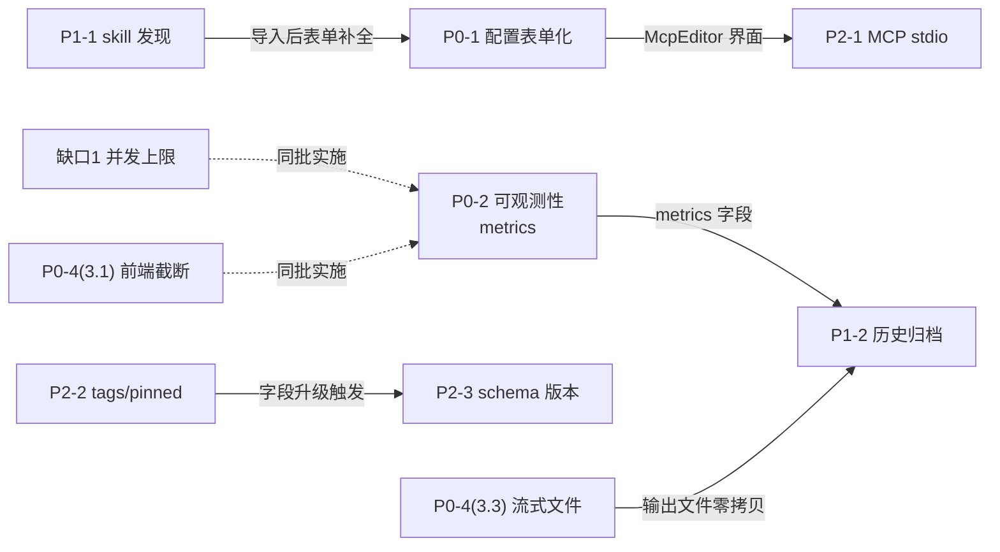

# AI 功能菜单优化 — 文档总览与实施路线

**日期**：2026-09-08
**范围**：基于 [[2026-09-08-ai-skill-menu-design]]（已实施）的后续 7 份优化设计文档 + 头脑风暴补充的 3 个缺口
**状态**：待评审

## 1. 背景

[[2026-09-08-ai-skill-menu-design]] 已实施 AI 功能菜单（Claude Skills 聚合触发器），完成执行器、多段编排、Tab 复用、配置自愈。实施走读后识别出 7 个后续优化方向，每方向独立 design 文档；2026-09-08 头脑风暴基于代码探查另识别 3 个文档外缺口，本总览汇总关系、优先级、实施顺序与缺口处置，作为入口索引。

## 2. 文档清单

| 编号 | 文档 | 优先级 | 主题 |
| --- | --- | --- | --- |
| P0-1 | [[2026-09-08-ai-config-form-design]] | P0 | 配置对话框高级字段表单化 |
| P0-2 | [[2026-09-08-ai-task-observability-design]] | P0 | 任务可观测性（token/耗时/exitCode） |
| P0-3 | [[2026-09-08-ai-concurrency-control-design]] | P0 | 全局并发执行上限（头脑风暴补充） |
| P0-4 | [[2026-09-08-ai-output-memory-design]] | P0/P1 | 大输出内存积累治理（3.1 前端截断 P0，3.3 流式文件 P1，头脑风暴补充） |
| P1-1 | [[2026-09-08-ai-skill-discovery-design]] | P1 | skill 自动发现与一键导入 |
| P1-2 | [[2026-09-08-ai-run-history-design]] | P1 | 运行历史归档 |
| P2-1 | [[2026-09-08-ai-mcp-stdio-design]] | P2 | MCP server stdio 类型支持 |
| P2-2 | [[2026-09-08-ai-function-search-design]] | P2 | 功能项搜索/分组/置顶 |
| P2-3 | [[2026-09-08-ai-config-schema-design]] | P2 | 配置 schema 版本与迁移 |

## 3. 优先级判定依据

| 优先级 | 判定 | 归属文档 |
| --- | --- | --- |
| P0 | 可视化集成收尾 / 数据已在手边被丢弃，低成本高回报 | P0-1、P0-2 |
| P1 | 兑现设计文档原始痛点（skill 散落、过程不可视） | P1-1、P1-2 |
| P2 | 功能扩展与健壮性增强，当前规模未到临界 | P2-1、P2-2、P2-3 |

## 4. 依赖关系

| 依赖 | 说明 |
| --- | --- |
| P0-2 → P1-2 | 历史归档复用 `AiTaskMetrics`，须先有可观测性 |
| P2-1 → P0-1 | stdio 的 McpEditor 分支依赖配置表单化的 McpEditor 组件 |
| P1-1 → P0-1 | 导入后用表单补全 params 等，建议配套做 |
| P2-2 → P2-3 | tags/pinned 字段演进直接走 schema v2 迁移，合并做 |
| 缺口2-3.3 → P1-2 | 流式输出文件随历史归档落地，`os.Rename` 零拷贝衔接归档，避免大对象过 IPC |

## 5. 实施顺序建议

| 批次 | 文档 / 缺口 | 理由 |
| --- | --- | --- |
| 第 1 批 | P0-2 可观测性 + P0-3 并发上限 + P0-4(3.1) 前端截断 | 零依赖，数据已在 stdout；并发控制与前端截断同处 `service/ai_function.go` 与 `AiFunctionPanel.vue`，改动集中 |
| 第 2 批 | P0-1 配置表单化 + P2-1 stdio | 表单化时一并做 McpEditor 的 stdio 分支，避免返工 |
| 第 3 批 | P1-2 历史归档 + P0-4(3.3) 流式文件 | 依赖 P0-2 metrics；输出文件 `os.Rename` 零拷贝衔接归档 |
| 第 4 批 | P1-1 skill 发现 + P0-1 联调 | 导入后表单补全，配套验证 |
| 第 5 批 | P2-2 + P2-3 合并 | tags/pinned 字段升级直接走 schema v2 迁移 |

## 6. 实施前需决策或抓样的点

| 文档 / 缺口 | 待确认项 |
| --- | --- |
| P0-2（已定） | `result` 事件字段已抓样确认（claude v2.1.158），成本字段为 `total_cost_usd`（非 `cost_usd`）；采集顶层耗时/轮次/成本/is_error + usage 四 token 字段，不采 modelUsage 等细分。抓样归档 `docs/plans/samples/result-event-sample.json`，详见 [[2026-09-08-ai-task-observability-design]] 第 4.1/7 节 |
| 缺口 1（已定） | 并发上限 3；策略 C 排队+状态可见；超时起算后移到获取信号量后；tasks map 清理同批补；运行中 Tab 禁止关闭。详见 [[2026-09-08-ai-concurrency-control-design]] 第 7 节 |
| 缺口 2（已定） | 末尾窗口 256KB 可配置；事件合并 30ms 视 3.1 后实测；表格视图后端预解析 `TableExtracted`；copy 全量读取 3.1 用 `t.fullOutput`、3.3 用 `GetAiTaskOutput`；输出文件清理三路径（Tab 关闭/归档接管/定时）。详见 [[2026-09-08-ai-output-memory-design]] 第 7 节 |
| P1-1 | 插件 skill（marketplace）的目录结构与命名空间拼接规则 |
| P2-1 | `--mcp-config` 内联 JSON 对 stdio server 的字段要求 |
| P2-2 | 分组方案：tag chips 筛选 vs 折叠分组 vs 结合 |
| P2-3 | 是否引入 gojsonschema 做校验；备份文件保留策略 |

## 7. 头脑风暴补充的缺口

基于代码探查识别出 7 份 design 文档外的 3 个缺口，探查结论与处置如下：

| 缺口 | 探查结论 | 处置 |
| --- | --- | --- |
| 全局并发执行上限 | `RunStage` 无全局信号量，N 功能项可同时起 N 个 claude 进程，本地资源抢占致超时误判 | 纳入本轮，与 P0-2 同批（第 1 批） |
| 大输出内存积累 | 输出全链路全量驻留（后端 Builder + 前端 `t.output +=` + `<pre>` 重渲），agree-slides 类长输出致前端卡顿 | 3.1 前端截断提前到 P0-2 同批；3.3 流式文件随 P1-2 |
| prompt / 输出敏感信息脱敏 | 初判有误：env 走 `$ENV:` 机制不进历史，token 不泄露；真实暴露面为 prompt 业务数据与输出回显 | 降为可选，`AiFormField.Sensitive` 标记随 P0-1 顺带 |

### 7.1 缺口 1：全局并发执行上限（[[2026-09-08-ai-concurrency-control-design]]）

| 项 | 说明 |
| --- | --- |
| 现状 | `AiFunctionService` 仅 `mu sync.Mutex` + `tasks map`，`RunStage`（service/ai_function.go:116）直接 `cmd.Start()`，无信号量；`s.mu` 只保护单 task 字段与 map 写入，不阻止并发起进程 |
| 风险 | 多 Tab 并发起 claude 进程，单进程常驻 ~150-300MB，5 并发即 ~1-1.5GB；API 侧限流致集体超时；超时 `ctx` 从 `Start()` 起算，本地资源抢占侵蚀执行预算，10 分钟超时可能在仅 3 分钟有效工作时触发 |
| 方案 | `AiFunctionService` 增 `concurrencySem chan struct{}`（默认 3），`RunStage` 获取信号量、`pumpOutput` defer 释放；获取用 `select` + `ctx.Done()` 分支响应取消 |
| 超限策略 | 推荐 C：排队 + `ai-task:queued` 事件 + Tab 排队态（A 阻塞误导、B 需手动重试） |
| 超时起算 | 改为获取信号量后 `WithTimeout`，排队等待不计入执行预算 |
| 配套 | `tasks` map 清理与并发上限无耦合（信号量随进程退出释放，不占槽位），但同属 `AiFunctionService` 内存治理，建议同批补（详见独立 design 4.6 节） |

### 7.2 缺口 2：大输出内存积累（[[2026-09-08-ai-output-memory-design]]）

输出数据全链路三段均全量驻留：后端 `strings.Builder` 写入 → `GetAiTaskState`/`AiTaskRunResult` 全量 `String()` 拷贝 → 前端 `t.output += ev.text` 累加 → `<pre>{{ t.output }}</pre>` 重渲。分三层独立落地：

| 层 | 方案 | 成本 | 时机 |
| --- | --- | --- | --- |
| 3.1 前端末尾窗口截断 | `onOutput` 超 256KB 只保留末尾，顶部提示省略 KB 数与查看历史入口 | 低，零后端改动 | 提前到 P0-2 同批（第 1 批） |
| 3.2 事件时间窗口合并 | `pumpOutput` 按 30-50ms 批量 flush，IPC 次数数千降为数十 | 中 | 视 3.1 后实测 IPC 压力决定是否做 |
| 3.3 流式写文件 | `output strings.Builder` → `*os.File` + `outputSize`；`GetAiTaskState` 返回尾部预览；新增 `GetAiTaskOutput` 全量读 | 高 | 随 P1-2（第 3 批），`os.Rename` 零拷贝衔接归档 |

**隐藏难点**：`meetingTable` 表格视图依赖从 `t.output` 解析 markdown 表格，前端截断后表格可能丢失，须后端 `GetAiTaskState` 预解析表格一并返回，或表格视图触发时单独全量读取。`copy`/`preview` 完成动作改为调后端全量读取，不再取已截断的 `t.output`。

### 7.3 缺口 3：敏感信息脱敏（已探查，暂不纳入）

初判"prompt 含展开后真实 token"不成立。代码探查确认各敏感数据的实际去向：

| 数据 | 存储与去向 | 是否进历史 |
| --- | --- | --- |
| env 凭证（`$ENV:VAR`） | `expandEnvRef` 展开后注入 `--settings` 进程参数，不进 prompt 正文、不进 stdout | 否 |
| MCP URL / headers | `json.Marshal` 注入 `--mcp-config` 进程参数 | 否 |
| form / text / file 参数 | `BuildStagePrompt` 渲染进 prompt 正文，作 `-p` 参数 | 是 |
| claude 输出回显 | 子进程 stdout → `task.output` → `AiTaskRunResult.Output` | 是 |

**结论**：凭证已由 `$ENV:` 机制隔离，配置文件归档不泄露 token。真实暴露面收敛为 prompt 业务数据（客户名、会议密码等）与输出回显两类。`AiFormField` 增 `Sensitive bool` 标记随 P0-1 表单化顺带加入（零额外成本，表单里才能标敏感）；输出模式匹配打码因误报率高、破坏可读性，降为可选严格级开关。本缺口不强制纳入 P1-2 范围，待 P1-2 落地后视工作目录是否同步/共享再定。

## 8. 不建议现阶段做的

| 方向 | 理由 |
| --- | --- |
| 危险动作二次确认 | 默认 `bypassPermissions` 对个人工作台本地文件型 skill 风险可控，等接入 git push / 删除类 skill 再加 |
| 多端访问 / Web 化 | [[2026-09-08-ai-skill-menu-design]] 第 3 节已论证，本地文件操作型无 Web 胜出点 |
| 历史导出报告 | P1-2 先做展示，月度统计导出属后续增强 |

## 9. 关联

- 来源：[[2026-09-08-ai-skill-menu-design]]（已实施的 AI 功能菜单主设计）
- 路径：本总览与 7 份 design 文档同处 `docs/plans/`
- 头脑风暴：缺口 1/2/3 的探查基于 `service/ai_function.go`（`RunStage`/`pumpOutput`/`buildClaudeArgs`/`expandEnvRef`）、`model/ai_function.go`（`AiTaskState`/`AiTaskRunResult`）、`AiFunctionPanel.vue`（`onOutput`/`onDone`/`<pre>` 渲染）的代码走读
