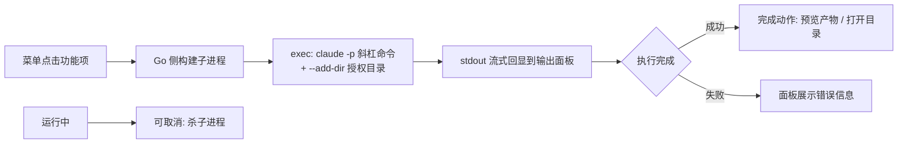

# AI 功能菜单（Skill 聚合）设计

> 日期：2026-09-08
> 状态：已实施（2026-09-08 实施完成，关键修订见文末「8. 实施修订」）
> 来源：个人工作台需求讨论会话沉淀（2026-09-08）

## 目录

1. [摘要](#1-摘要)
2. [背景与痛点](#2-背景与痛点)
3. [方案决策](#3-方案决策)
4. [功能设计](#4-功能设计)
5. [待确认点](#5-待确认点)
6. [待办清单](#6-待办清单)
7. [总结](#7-总结)

## 1. 摘要

将散落在不同目录的 Claude Code skills（生成周报、文档转 HTML 发言稿、生成腾讯会议号等）聚合为 WorkBench 内的可视化功能菜单。用户在界面一键触发，由 Go 侧起子进程执行 `claude -p "/skill名"` headless 调用，输出流式回显到面板，产物可直接预览或打开所在目录。**不新建 Web 页面，直接基于 WorkBench（本项目）增强。**

## 2. 背景与痛点

现状工作流：

- 日常重复动作（生成周报、文档转发言稿、生成会议号等）已沉淀为多个 Claude Code skills
- skills 散落在不同目录（各项目 `.claude/skills/` 下）
- 每次使用需手动：开终端 → cd 到对应目录 → 启动 `claude` → 敲斜杠命令执行

痛点：

| 痛点 | 说明 |
| ---- | ---- |
| 触发路径长 | 开终端、记目录、记命令，高频动作成本高 |
| skills 散落 | 无统一入口，忘记 skill 存在或所在位置 |
| 过程不可视 | 终端窗口关闭即丢失输出，无历史记录 |

原始诉求演进：最初设想「个人工作台」（范围未定），经讨论收敛为「将常用命令/指令封装为功能菜单」，最终明确定位为「Claude skills 聚合触发器」。

## 3. 方案决策

对比过两个方向：新建独立 Web 页面 vs 基于 WorkBench 增强。**结论：基于 WorkBench 增强。**

| 维度 | 基于 WorkBench 增强 | 新建 Web 页面 |
| ---- | ---- | ---- |
| 壳子成本 | 零：工具箱已有入口，加页面即可 | 全新搭建路由/菜单/构建/部署 |
| 本地文件访问 | 原生（周报扫本地库、产物直接落盘） | 需起本地服务或上传下载 |
| 结果展示 | 复用现有终端输出 + HTML/Markdown 预览 | 需自研 |
| 示例功能契合度 | 全部为本地文件操作型，桌面应用天然优势 | 低 |
| 多端访问 | 无（单机桌面） | 有（手机/远程） |
| 维护成本 | 一个项目 | 两个项目 |

放弃 Web 的原因：三个示例功能全是本地文件操作型，无多端访问需求，Web 无胜出点。

## 4. 功能设计

### 4.1 执行链路



关键机制：

| 机制 | 用途 |
| ---- | ---- |
| `claude -p "/skill名 参数"` | headless 触发 skill，等效终端敲斜杠命令 |
| `--add-dir <目录>` | 给会话额外目录读权限（周报扫碎碎念库、发言稿读文档目录） |
| 子进程 `cwd` 设为 skill 所在项目 | 项目级 skill 才能被自动发现 |
| 流式输出读取 | 长任务不干等，面板实时滚动日志 |

### 4.2 功能项配置模型

功能菜单 = **可配置命令注册表**，不逐个功能硬编码。配置存 JSON（放 WorkBench 现有 `data/` 配置体系），后续新增 skill 只加配置不改代码。

```yaml
功能项:
  id: weekly-report
  名称: 生成周报
  skill: weekly-report        # 拼接为 claude -p "/weekly-report"
  cwd: D:\工作\Typora          # 子进程工作目录（skill 依赖的库位置）
  addDirs: []                 # 额外授权目录列表
  参数: none / fixed / file   # 见 4.3 参数输入
  完成动作: open_dir           # none / open_dir / preview
  图标: xxx
```

首批三个功能项：

| 功能 | skill（暂定名） | cwd 暂定 | 完成动作 |
| ---- | ---- | ---- | ---- |
| 生成周报 | weekly-report | D:\工作\Typora | 打开产物目录 |
| 文档转 HTML 发言稿 | md-to-speech | 待定 | 预览产物（复用现有 HTML 预览） |
| 生成腾讯会议号 | tencent-meeting | 待定 | 无（输出即结果，复制到剪贴板） |

### 4.3 界面设计

位置：工具箱（左侧活动栏）新增「AI 功能」页。

- **功能列表**：卡片/列表展示功能项，显示名称、描述、图标，点击运行
- **输出面板**：运行中显示流式输出；同一时间允许多个任务并行，每个任务一个 Tab；任务可取消
- **参数输入**（若确认需要）：运行前弹简单表单
  - 参数类型 `file`：复用文件树选择文件（WorkBench 原生体验）
  - 参数类型 `fixed`：固定参数直接拼接
  - 参数类型 `none`：直接运行
- **配置管理**：功能项的增删改（列表 + 表单），读写配置 JSON

### 4.4 skills 目录收拢（前置动作）

散落目录是痛点根源。Claude Code CLI 自动发现两级 skills：

| 层级 | 位置 | 放什么 |
| ---- | ---- | ---- |
| 用户级 | `~/.claude/skills/` | 通用 skill（周报、发言稿、会议号——与项目无强绑定） |
| 项目级 | `<项目>/.claude/skills/` | 强绑定该项目的 skill |

首批三个功能均为通用型，建议全部迁至用户级目录。迁移后功能项配置中的 `cwd` 仅用于指定 skill 的数据目录（如周报扫描的笔记库），不再承担 skill 发现职责。

## 5. 待确认点

实施前必须答复：

1. **skills 现状盘点**：三个 skill 目前分别在哪些目录？是否还有其他候选 skill 要纳入菜单？（决定迁移工作量）
2. **是否需要参数输入 UI**：发言稿选源文件是否要在界面选（复用文件树）？不需要的话第一版全部无参数直跑，更快。

## 6. 待办清单

- [ ] 待办 0（前置）：答复第 5 节两个确认点
- [ ] 待办 1：skills 收拢——三个 skill 迁移至 `~/.claude/skills/`，终端验证各 skill 可在任意目录触发
- [ ] 待办 2：撰写 `2026-09-08-ai-skill-menu-plan.md` 实施计划（依据本设计 + 确认点答复，拆解到文件级改动）
- [ ] 待办 3：后端——功能项配置模型 + JSON 读写（挂入现有配置体系）
- [ ] 待办 4：后端——子进程执行器：构建 `claude -p` 命令、流式读取 stdout、取消（杀进程）、超时控制
- [ ] 待办 5：前端——工具箱新增「AI 功能」页：功能列表 + 运行按钮
- [ ] 待办 6：前端——输出面板：多任务 Tab、流式滚动、取消按钮
- [ ] 待办 7：前端——配置管理界面（功能项增删改）
- [ ] 待办 8：（视确认点 2 结果）参数输入表单 + 文件选择
- [ ] 待办 9：完成动作落地——预览产物 / 打开目录 / 复制输出
- [ ] 待办 10：联调测试：三个 skill 全链路跑通 + 取消/失败场景

依赖关系：待办 0 → 待办 2 → 待办 3~9 → 待办 10；待办 1 与待办 3~7 可并行。

## 7. 总结

本需求本质是「Claude skills 聚合触发器」：不重复造壳，WorkBench 已具备工具箱入口、终端、文件预览、文件读写全部基础设施，只需新增配置化功能菜单页与子进程执行器。实施前需完成 skills 目录收拢与两个确认点答复，随后产出文件级实施计划。

## 8. 实施修订（2026-09-08，以本节为准）

skills 真身盘点后，4.2/4.4 两节假设作废，按以下修订实施：

| 原设计 | 实施修订 | 原因 |
| ---- | ---- | ---- |
| 4.4 skills 全迁用户级 `~/.claude/skills/` | 不迁移，功能项 cwd 指向各项目根（u63 周报 / u51 发言稿 / u54 会议） | 发言稿 skill 是 ab-office 插件（marketplace 机制，不可复制迁移）；周报链与会议 token 依赖各项目 settings/env |
| 4.2 `claude -p "/skill名"` 单发 | 多段编排：每段独立 `claude -p`，第二段 `--resume` 续会话；面板按钮承载人工确认 | 周报「亮点须确认才落终稿」、会议「取消前必须确认」含交互回合，单发非交互无法承载 |
| 4.2 会议号依赖 skill 自带 MCP | MCP server 由执行器 `--mcp-config` 内联 JSON 注入 + `--settings` 注入 env token | tencent-meeting-mcp 的 MCP server 从未挂载进 claude 配置（skill 仅为使用规范文档）；注入集中在 WorkBench 配置，u54 项目零改动 |
| 4.3 参数 file/fixed | 扩展为 none/file/text/form 四型（form 支持字段化表单模板渲染） | 会议预约需多字段表单；会议取消需单值输入 |

配置模型落地为 `data/ai_functions.json`（字段含 id/命令/cwd/addDirs/env/mcp/permissionMode/timeout/completion/params/followUps），界面完整增删改。详细决策记录见 `.trellis/tasks/09-08-ai-skill-menu/prd.md`。
