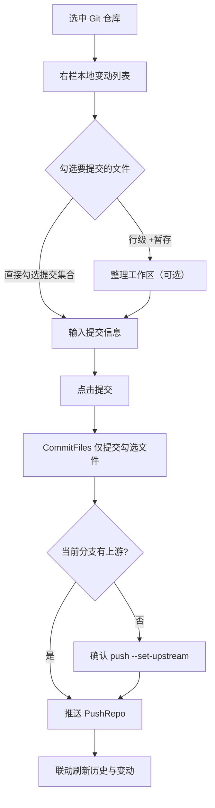

# WorkBench 快速入门

> 面向新用户的上手指南：从安装到完成第一次 Git 提交、第一次 AI 功能运行。
> 本文只描述已落地的功能，未实现的能力不在范围。功能细节请参阅 [功能说明](功能说明.md)。

---

## 1. 简介

**WorkBench** 是一款基于 Wails v2 + Vue 3 构建的 Windows 桌面开发者工作台，将日常散落在多个工具中的操作收敛为单一应用：

- **工作目录管理** —— 集中管理多个代码仓库，一键切换、批量拉取。
- **文件树与文件操作** —— 懒加载文件树、就地预览编辑、右键菜单集成外部编辑器。
- **Git 集成** —— 提交 / 推送 / 分支 / 合并 / 变基 / 标签 / 远程 / 子模块，无需离开应用。
- **AI 功能（Skill 聚合）** —— 将散落各项目的 Claude Code skills 聚合为可视化菜单，一键触发。
- **内置终端、命令面板、仓库统计** —— 覆盖高频开发动作。

**解决的核心问题**：多仓库来回切换窗口成本高、Git 图形操作与命令行割裂、Claude skills 入口分散难记忆。WorkBench 把这些收进一个窗口。

---

## 2. 安装与启动

### 2.1 环境要求

| 项 | 要求 | 说明 |
|---|---|---|
| 操作系统 | Windows 10 / 11 | 依赖 WebView2 运行时（Win10+ 通常已内置） |
| Go | 1.26+ | 仅源码构建需要，预构建包不需要 |
| Node.js | 20+ | 仅源码构建需要，对齐 CI 版本 |
| Wails CLI | v2 | 仅源码构建需要，安装见 [Wails 官方文档](https://wails.io/docs/gettingstarted/installation) |
| WebView2 | Evergreen | 缺失时窗口空白，见 [常见问题](常见问题.md) |

### 2.2 方式一：下载预构建应用（推荐普通用户）

1. 前往项目的 GitHub Releases 页面。
2. 下载最新版 `workbench.exe`（约 33 MB，含 PDF 预览静态资源）。
3. 双击运行即可，无需安装。

> 项目远程主仓库为 Gitee，推送 tag 后自动镜像至 GitHub 并由 CI 构建发布。Releases 页面的产物由 `release.yml` 流水线在 Windows runner 上 `wails build` 生成。

### 2.3 方式二：从源码构建（开发者）

```bash
# 1. 安装前端依赖
cd frontend && npm install

# 2. 生产构建（输出 build/bin/workbench.exe）
wails build
```

构建产物位于 `build/bin/`，可直接运行 `workbench.exe`。

### 2.4 启动应用

| 模式 | 命令 | 用途 |
|---|---|---|
| 开发调试 | `wails dev` | 热重载，前端改动即时生效，自带浏览器开发者工具 |
| 生产运行 | 双击 `build/bin/workbench.exe` | 日常使用 |

首次启动会自动创建 `data/` 目录存放配置（工作目录、收藏夹、设置等），该目录不提交 Git。

---

## 3. 首次配置

### 3.1 添加工作目录

**工作目录是 WorkBench 的入口单位**，添加后才能浏览文件树与使用 Git 功能。

1. 启动应用，左侧「工作目录」面板顶部点击「添加目录」。
2. 填写目录名称与路径（如 `D:\workspace\my-repo`），可勾选「设为默认」。
3. 确定后该目录出现在左侧列表。

**Git 仓库标识**：路径下含 `.git` 的目录会显示 Git 图标——已配置远程显示彩色，未配置远程显示灰色，一眼识别。

**批量管理**：

- 右键目录可「设为默认」「复制路径」「在资源管理器 / VSCode / Warp / Obsidian 中打开」「更新仓库」「删除（Delete）」。
- 顶部「批量更新」可一键 pull 所有仓库，未配置远程的本地仓库自动跳过。
- 工作目录列表支持「导出 / 导入」配置（含收藏夹），便于换机迁移。

### 3.2 收藏夹

收藏夹用于快速跳转到常用深层子目录，不必每次展开文件树。

- 在文件树右键目录 →「添加到收藏夹」，可设别名与分组。
- 命令面板（`Ctrl+P`）中输入收藏别名快速跳转。
- 收藏夹支持分组管理、右键移除。

### 3.3 设置面板

顶部「设置」入口打开弹窗，左右双栏布局，四个标签页：

| 标签页 | 可配置项 |
|---|---|
| 通用 | 主题（跟随系统 / 浅色 / 暗色）、Obsidian 程序路径、外部 diff 工具（预设 Beyond Compare / WinMerge / VSCode diff / 自定义） |
| 终端 | 默认 Shell 类型（PowerShell / CMD / Git Bash / WSL）、自定义 Shell 路径 |
| 搜索 | 内容搜索的扩展名过滤、排除规则 |
| 快捷键 | 录制「命令面板 / 切换终端 / 重命名 / 删除」四个快捷键 |

设置项自动保存到 `data/settings.json`，重启保留。

---

## 4. 核心流程

### 4.1 打开仓库与文件树浏览

1. 左栏点击一个 Git 仓库工作目录。
2. 中栏文件树懒加载展开，文件夹优先排序，`.git` 自动过滤。
3. 选中 Git 仓库节点后，右栏操作面板直接显示**仓库信息、提交历史、本地变动**，无需再在文件树点选。
4. 文件树节点右键支持新建文件 / 文件夹、重命名（`F2`）、删除（`Delete`）、剪切 / 复制 / 粘贴、拷贝到、在外部编辑器打开。

> 截图占位：三列布局——左栏工作目录树、中栏文件树、右栏操作面板。

### 4.2 Git 提交与推送

这是 WorkBench 最高频的流程，整体路径如下：



**操作步骤**：

1. **查看变动**：选中仓库后右栏「本地变动」单表分组展示——未暂存组在上、已暂存组在下，每行带 `+暂存` / `-取消暂存` 行级按钮（对应 `StageFiles` / `UnstageFiles`，`git restore --staged` 统一命令）。
2. **查看差异**：双击变动文件弹窗双栏对照 diff（已跟踪对比 HEAD，未跟踪展示新增全文；二进制 / 图片 / 超大文件给出友好提示）。
3. **选择性提交**：通过复选框勾选本次要提交的文件，输入提交信息，点击「提交」。后端 `CommitFiles(path, message, filePaths)` 按 pathspec 语义**仅提交勾选文件**，未勾选文件保持未提交。
4. **推送**：点击「推送」调用 `PushRepo`。当前分支无上游时弹确认是否 `git push --set-upstream origin <分支>`，凭证透传系统 git 配置。

**并发约束**：变更类 Git 操作（commit / push / pull / checkout / merge 等）按仓库路径串行化——同一仓库已有变更操作进行中时，后续请求被拒绝并提示「该仓库有 Git 操作进行中，请稍后重试」。不同仓库互不阻塞，只读操作（查看分支 / 变动 / diff）不受影响。

### 4.3 分支管理

右栏切换到分支面板（`GitBranches`），对齐标签 / 远程 / 合并面板范式：

| 操作 | 说明 |
|---|---|
| 查看分支 | 列出本地分支，标记当前分支（远程分支不展示） |
| 切换分支 | `CheckoutBranch`，含远程分支 |
| 创建分支 | 从当前 HEAD `git branch <name>` |
| 删除分支 | `git branch -d`，未合并失败后二次确认走 `-D` 强删，当前分支禁删 |
| 重命名分支 | `git branch -m <old> <new>`，仅本地不触远程 |

**合并 / 变基 / 拣选**：`GitMerge` 面板支持合并（ff / no-ff / squash 三策略，合并前校验工作区干净）、变基（`git rebase <branch>`，冲突支持 `--continue` / `--abort` / `--skip`）、Cherry-pick 单提交拣选。冲突时展示冲突文件列表，「打开」调外部编辑器手动改冲突标记、「标记已解决」执行 `git add`，全部解决后 continue 提交，各操作均提供 abort 逃生口。

### 4.4 AI 功能触发

左侧活动栏「AI 功能」一级入口，占满主区，将散落各项目的 Claude Code skills 聚合为可视化菜单。

**触发流程**：

1. 在侧栏搜索框按名称 / 描述 / 标签模糊匹配，或用 tag chips 多选筛选。
2. 点击功能卡片打开功能 Tab（详情 + 参数录入 + 运行按钮）。
3. 录入参数后点击「运行」，后端 `RunAiFunction(functionID, params)` 启动 `claude -p` headless 子进程，`--output-format stream-json` 流式回显到输出面板。
4. 任务可取消（杀进程树）、可超时（功能项配置分钟数，默认 10），多任务并行、每任务一 Tab。

**执行机制要点**：

- 子进程 `cwd` 设为 skill 所在项目根，项目级 settings / env 原样生效。
- 全局信号量限制同时运行 3 个 claude 子进程，超限任务排队等待。
- 任务完成后自动归档到 `data/ai_task_history/`，标题栏「历史」可按功能 / 时间 / 状态筛选查看。
- 频次排序开关开启时，功能卡片按运行次数角标排序（取消不计入）。

**首批功能**：生成周报、文档转 HTML 发言稿、预约腾讯会议、查看 / 取消腾讯会议。功能项存 `data/ai_functions.json`，面板「配置管理」支持增删改，并支持从已发现的 skill 一键导入。

> 截图占位：AI 功能菜单——左侧功能卡片列表、右侧功能 Tab 参数录入与运行输出。

### 4.5 文件预览

在文件树点击文件，右栏操作面板按文件类型直接预览，无需外部程序：

| 类型 | 支持 |
|---|---|
| 文本 / 代码 | CodeMirror 6 只读高亮（行号、折叠、虚拟滚动）；GBK 自动解码为 UTF-8 显示 |
| Markdown | markdown-it 渲染 + mermaid 图形 + 标题目录 + frontmatter 属性面板 + 相对链接面板内跳转 |
| 图片 | jpg / png / bmp / gif / webp，base64 内嵌，支持缩放 |
| Office | Word `.docx` 用 docx-preview；Excel `.xlsx` / `.xls` / `.csv` 用 SheetJS 解析为只读表格 |
| PDF | pdfjs 官方 viewer 内嵌预览，支持翻页 / 缩放 / 搜索 / 缩略图，大 PDF 按 Range 读取 |
| HTML | 默认浏览器渲染效果（iframe sandbox 隔离），工具栏「源码 / 渲染」切换，「刷新」重载 |

**就地编辑**：文本类预览可一键切回编辑，`Ctrl+S` 保存，按原文件编码（UTF-8 / GBK）写入不改变原编码。文件大小限制 1 MB，超过走降级提示。

### 4.6 仓库统计

活动栏「仓库统计」一级入口，复用提交历史缓存聚合可视化，不重复扫 git log：

- **提交趋势图** —— 按日 / 周 / 月聚合，固定档位 7 天 / 30 天 / 90 天 / 1 年 / 全部，粒度随档位自动适配。
- **活跃度热力图** —— 类 GitHub 草地，最近一年按日，5 档色阶。
- **贡献者排名** —— 横向柱状，按提交数降序，同名不同邮箱视为不同贡献者。

超限仓库（>5000 commit）取最近 5000 条采样统计并提示。基于 ECharts 按需引入渲染。

---

## 5. 常见问题

遇到问题先查 [常见问题](常见问题.md)，覆盖以下高频场景：

- 文件树不显示 / 切换节点预览不清空
- 端口 34115 被占用
- 前端依赖错误 / Wails 绑定生成失败
- Go 编译错误 / WebView2 运行时缺失
- 文件预览支持的类型与限制
- 应用启动慢 / 文件树加载缓慢

查看后端日志：生产模式落盘 `data/logs/app.log`（slog + lumberjack，5 MB 轮转保留 5 份）；开发模式额外输出到终端。

---

## 6. 下一步

- 完整功能清单：[功能说明](功能说明.md)
- 开发与构建流程：[开发工作流](开发工作流.md)
- 项目发展规划：[路线图](路线图.md)
- 参与贡献：[贡献指南](贡献指南.md)

---

**最后更新：** 2026-09-14
**维护者：** 刘阳 <liuyang06@agree.com.cn>
