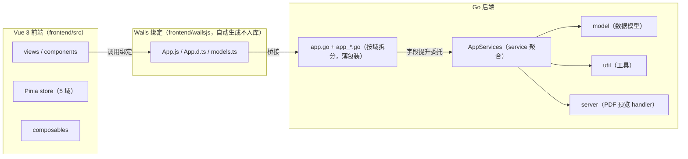
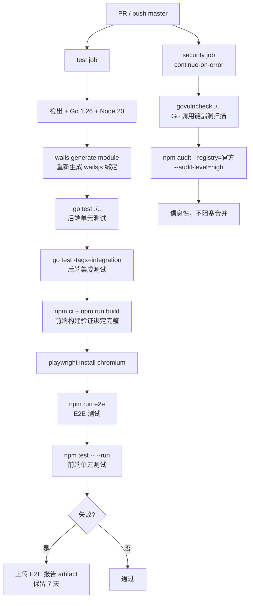

# WorkBench 贡献指南

> 面向参与 WorkBench 开发的贡献者：环境准备、开发工作流、测试规范、提交与 PR 流程、项目规范沉淀规则。
> 本文只描述项目实际执行的流程与约定，规范细节请参阅链接的 spec 文档。

---

## 1. 环境准备

### 1.1 必备工具

| 工具 | 版本 | 安装方式 | 说明 |
|---|---|---|---|
| Go | 1.26+（toolchain 1.26.6） | [官网](https://go.dev/dl/) | go.mod 声明 `go 1.26.0` 最低兼容，`toolchain go1.26.6` 指定实际版本，GOTOOLCHAIN=auto 自动切换 |
| Node.js | 20+ | [官网](https://nodejs.org/) | 对齐 CI 的 `setup-node` 版本 |
| Wails CLI | v2 | `go install github.com/wailsapp/wails/v2/cmd/wails@v2` | 桌面框架命令行，[官方文档](https://wails.io/docs/gettingstarted/installation) |
| Git | 任意现代版本 | 系统自带 | 集成测试需真实 git 构造仓库 fixture |
| WebView2 | Evergreen | Win10+ 自带 | 缺失时窗口空白，见 [常见问题](常见问题.md) |

### 1.2 克隆与初始化

```bash
# 克隆仓库（远程主仓库为 Gitee，自动镜像至 GitHub）
git clone <repo-url> workbench
cd workbench

# 安装前端依赖
cd frontend && npm install
```

### 1.3 验证环境就绪

```bash
# 后端编译 + 测试
go test ./...

# 前端构建（验证 wailsjs 绑定完整，本机首次须先 wails generate module）
wails generate module
cd frontend && npm run build

# 启动开发模式
wails dev
```

> `frontend/wailsjs/` 整目录在 `.gitignore` 中不入库，本机与 CI 均须先 `wails generate module` 重新生成绑定，否则 `vite build` 缺 `wailsjs/go/main/App` 模块必失败。

---

## 2. 项目结构概览

WorkBench 采用 Go 后端 + Vue 3 前端的 Wails v2 桌面架构，分层清晰：



**分层职责**：

| 层 | 目录 | 职责 |
|---|---|---|
| 前端视图 | `frontend/src/views`、`frontend/src/components` | UI 编排、跨组件调度 |
| 前端状态 | `frontend/src/store` | Pinia setup store，按域拆 5 个（favorites / settings / ui / directory / workspace） |
| Wails 绑定 | `frontend/wailsjs` | 自动生成的 JS/TS 绑定，不入库 |
| App 桥接层 | `app.go` + `app_*.go` | `App` 结构体导出方法，转发到 service，薄包装 |
| Service 聚合 | `app_services.go` | `AppServices` 集中装配 15 个 service/cache，App 内嵌 `*AppServices` 字段提升 |
| 业务逻辑 | `service/` | Git / 文件树 / AI / 终端 / 设置等业务实现 |
| 数据模型 | `model/` | 纯数据结构、校验、AppError 错误码 |
| 工具 | `util/` | 编码检测、Git 根查找、日志、剪贴板等 |
| 预览服务 | `server/` | PDF 预览 AssetServer handler（`/preview-pdf` 同源提供本地 PDF，支持 Range） |

完整目录树与组件清单见 [README 项目结构](../README.md#项目结构)。架构设计的分层契约与数据流细节见 [架构设计](架构设计.md)（v1.4 PR3 同期产出）。

---

## 3. 开发工作流

### 3.1 启动开发模式

```bash
wails dev
```

`wails dev` 启动后端 + 前端 Vite dev server，**热重载**：前端改动即时生效，Go 改动自动重编译。开发模式额外输出后端日志到终端，并自动打开浏览器开发者工具。

### 3.2 前端独立调试

纯前端调试可脱离 Wails 后端，独立跑 Vite：

```bash
cd frontend && npm run dev
```

此时 `window.go` / `window.runtime` 未注入，需配合 mock（E2E 与单测共用 `src/test/wails-mock-defaults.js` 单一数据源）。日常开发推荐 `wails dev` 以获得真实后端。

### 3.3 调试日志

| 端 | 工具 | 说明 |
|---|---|---|
| 前端 | `utils/debug.js` 的 `debug.log` / `debug.warn` / `debug.error` | 开发环境输出，生产静默；禁裸 `console.log` |
| 后端 | `log/slog` 结构化日志 | 落盘 `data/logs/app.log`（lumberjack 5 MB 轮转保留 5 份），禁 `println` |

详见 [开发规范 - 调试日志](开发规范.md#调试日志) 与 [logging-and-errors.md](spec/logging-and-errors.md)。

---

## 4. 测试规范

项目采用分层测试 + 覆盖率门禁，CI 强制全绿。

### 4.1 测试矩阵

| 类型 | 命令 | 覆盖 |
|---|---|---|
| 后端单元 | `go test ./...` | 模型校验、服务逻辑、Git 操作、文件 IO、AI 归档（约 170 用例） |
| 后端集成 | `go test -tags=integration ./...` | 真实 git 仓库 fixture 驱动提交 / 推送 / 分支 / 合并 / 变基 / 冲突 / submodule 全链路（`//go:build integration` 标签隔离，默认不编译） |
| 前端单元 | `cd frontend && npm test` | 组件行为、交互、边界、Pinia store、composable 纯逻辑（约 380 用例） |
| 前端覆盖率 | `cd frontend && npm run test:coverage` | v8 provider + thresholds 硬失败 |
| E2E | `cd frontend && npm run e2e`（首次先 `npm run e2e:install`） | Playwright + vite preview web 版，mock Wails 后端，六关键流程 UI 编排 |

E2E 采用**方案 C 混合架构**：前端 Playwright E2E 测 UI 编排、后端 Go 集成测试测业务链路，两侧各自稳定、CI 并行。详见 [测试策略](测试策略.md) 与 [e2e-testing.md](spec/e2e-testing.md)。

### 4.2 覆盖率门禁

**后端分层阈值**（`scripts/coverage-check.sh`）：

| 包 | 阈值 | 说明 |
|---|---|---|
| model | ≥ 80% | 纯逻辑 / 校验 |
| server | ≥ 80% | 预览 HTTP handler |
| service | ≥ 76% | 含 pty / 子进程 / 网络下载等系统调用核心，76% 为实际可达上限 |
| util | ≥ 40% | 排除 `pty_windows.go` 后计算 |
| 主包 | 不设门禁 | `app_*.go` 为转发 service 的薄包装 |

**前端阈值**（`vitest.config.js`）：lines / branches / functions / statements 全 ≥ 70%，硬失败，`exclude: ['wailsjs/**']`。

运行：`bash scripts/coverage-check.sh`（后端）、`cd frontend && npm run test:coverage`（前端）。门禁契约详见 [test-coverage-gate.md](spec/test-coverage-gate.md)。

### 4.3 测试稳定性

- 禁 `waitForTimeout`，靠 expect 自动重试。
- 依赖文件系统 mtime 时序判失效的测试在 NTFS 上 flaky，改注入陈旧缓存驱动失效分支，不用 `time.Sleep`。
- E2E 用例从 `e2e/fixtures.js` import `{test, expect}`（自动注入 Wails mock，禁直接 import `@playwright/test`）。
- mock 默认返回值单一数据源 `src/test/wails-mock-defaults.js`（vitest / E2E 共用）。

详见 [test-stability.md](spec/test-stability.md) 与 [e2e-testing.md](spec/e2e-testing.md)。

---

## 5. 分支与提交策略

### 5.1 分支策略

- **`master` 为主干**，保持可发布状态。
- **功能开发拉 `feature/<topic>` 分支**，完成后合并回 master；小修可直接在 master 提交。
- 发版经 `scripts/release.sh` 递增版本 → 改写 `wails.json` → 提交 → 打 tag → 推送，推送后 CI 自动构建发布。

### 5.2 提交信息规范

格式：`<type>: <subject>`，**使用中文祈使句**，说明为什么而非是什么。

| 类型 | 用途 |
|---|---|
| `feat` | 新功能 |
| `fix` | 修复 bug |
| `refactor` | 重构代码（不改变外部行为） |
| `perf` | 性能优化 |
| `docs` | 文档更新 |
| `test` | 测试相关 |
| `chore` | 构建 / 工具链 / 杂项 |

示例：

```bash
feat: 添加仓库统计活跃度热力图
fix: 修复文件树懒加载根节点检测以支持 node.level 属性
perf: 文件树冷扫描对象池减少分配
docs: 新增快速入门与贡献指南
refactor: 目录服务分离配置与业务逻辑
chore: 升级 go-git 至 v5.19.2
```

提交信息末尾由协作工具自动追加 `Co-Authored-By` 行，无需手写。完整规范见 [开发规范 - Git 提交规范](开发规范.md#git-提交规范)。

---

## 6. PR 流程

### 6.1 提交前自检清单

- [ ] `go test ./...` 全绿
- [ ] `go test -tags=integration ./...` 全绿（若改动 Git / submodule 链路）
- [ ] `go vet -unsafeptr=false ./...` 无告警（须带 `-unsafeptr=false`，原因见 [开发规范](开发规范.md#静态检查go-vet)）
- [ ] `cd frontend && npm test` 全绿
- [ ] `cd frontend && npm run build` 通过（vitest 不走 rolldown 全量打包，会漏 `MISSING_EXPORT`，build 为必要验收）
- [ ] `cd frontend && npm run e2e` 全绿（若改动 UI 编排）
- [ ] `bash scripts/coverage-check.sh` 不超阈值
- [ ] 若改 `app.go` / `app_*.go` 方法签名或 `model/` 导出 struct 字段：已同步 `frontend/wailsjs/` 三处（见第 8 节）
- [ ] 若新增 Go / npm 依赖：已跑 `govulncheck ./...` + `npm audit --registry=https://registry.npmjs.org --audit-level=high`

### 6.2 CI 检查项

PR 触发 `.github/workflows/ci.yml`，在 ubuntu-latest 上跑两个并行 job：



**test job**（失败阻塞合并）：后端单元 → 后端集成 → 前端构建 → E2E → 前端单元，失败时上传 E2E 报告与 trace（保留 7 天）。

**security job**（`continue-on-error`，不阻塞合并）：`govulncheck ./...`（Go 调用链分析）+ `npm audit --registry=https://registry.npmjs.org --audit-level=high`。发现 high 漏洞时标记失败但在 PR check 可见，信息性扫描。已知无补丁漏洞（如 `xlsx`）见 [security-scan.md](spec/security-scan.md)「已知接受风险」章节。

> **CI 前置**：`frontend/wailsjs/` 不入库，CI 干净环境须先 `wails generate module` 重新生成绑定，否则 `vite build` 必失败。本地提交前亦应跑 `npm run build` 验证绑定完整。

---

## 7. spec 沉淀规则

项目规范按**两级分流**沉淀，执行 trellis 工作流 Phase 3.3 时遵循：

| 内容级别 | 沉淀位置 | 判断标准 |
|---|---|---|
| 详细契约 / 主题文档 | `docs/spec/<topic>.md` | 需多节结构（触发条件、契约、错误矩阵、正反示例）才能说清 |
| 一两句级关键规则 | 项目根 `CLAUDE.md`「规范沉淀规则 → 关键规则」清单 | 每个 session 必知、一两句话可完整表达，附指向 `docs/spec/` 详细文档的链接 |

**禁止写入 `.trellis/spec/`**（该目录已于 2026-09-07 废弃移除）。即使 trellis-update-spec skill 文本仍指向旧路径，以 `CLAUDE.md` 本节规则为准。

现有 spec 文档索引见 [docs/spec/README.md](spec/README.md)，覆盖：跨层契约、测试覆盖率门禁、测试稳定性、AppServices 装配、日志与错误、E2E 测试、性能基线、安全扫描。新增 spec 须同步更新该 README 文件索引表与 `CLAUDE.md` 关键规则清单。

---

## 8. 跨层契约提醒

贡献者最容易踩的坑集中在 Go ↔ Wails 绑定 ↔ 前端的跨层同步。**改动前必读** [cross-layer-contracts.md](spec/cross-layer-contracts.md)，核心契约如下：

### 8.1 App 方法签名变更

修改 `app.go` 或 `app_*.go` 中 `App` 结构体的导出方法签名（增删参数、改类型）时，须手动同步 `frontend/wailsjs/` 三处：

| 文件 | 同步内容 |
|---|---|
| `go/main/App.js` | `export function X(arg1, arg2)` 参数数量 |
| `go/main/App.d.ts` | `X(arg1: string, arg2: string): Promise<...>` 参数类型 |
| `go/models.ts` | 若涉及新 struct / 具名类型 |

`frontend/wailsjs/` 整目录 gitignore，本机跑 `wails generate module` 自动生成；CI 也会重新生成。但若环境不可用须手动同步，**只改一处会导致类型提示与运行时行为不一致，且 vitest 不报类型错误极易漏**。

### 8.2 具名 string 类型作绑定参数

`model/` 下 `type X string`（如 `MergeMode`、`SubmoduleUpdateMode`）作 Wails 方法参数 / 返回值时，`wails generate module` 不为它在 `models.ts` 生成 `export type X = string` 别名，导致 `npm run build` 报 `MISSING_EXPORT`。须手动补，且 `npm test` 不报此错，**必须跑 `npm run build` 验证**。

### 8.3 model struct 字段变更

修改 `model/` 下被 Wails 暴露给前端的导出 struct 字段（含 json tag）时，须同步 `models.ts` 对应 class 的字段声明 + 构造函数赋值。`omitempty` json tag → TS 字段用 `?:` 可选，字段名按 json tag 映射。

### 8.4 新增 service

新增 service 须在 `app_services.go` 改两处：`AppServices` struct 加字段 + `NewAppServices` 加构造行。`AppServices` 必须在 package main（跨包内嵌未导出字段不提升）。App 内嵌 `*AppServices` 字段提升保委托方法与 Wails 绑定零 diff。详见 [app-services-assembly.md](spec/app-services-assembly.md)。

### 8.5 日志与错误

- 后端用 `log/slog`（禁 `println`），service 包内调 `Logger()`（SetLogger 注入），App 层调 `slog.X`。
- 需前端分流的错误用 `model.AppError{Code, Message}` 经 `main.go` ErrorFormatter 转 `{code, message}` 传前端，前端 `handleError` 按 code 分流（warning / error）。
- 新增错误码同步三处：`model/app_error.go` 常量表 + `frontend/src/utils/error.js` ErrorCode / WARNING_CODES + spec 文档。

详见 [logging-and-errors.md](spec/logging-and-errors.md)。

---

## 9. 联系维护者

- **维护者**：刘阳 <liuyang06@agree.com.cn>
- **相关文档**：
  - [开发规范](开发规范.md) — 代码风格、调试、错误处理、提交规范
  - [开发工作流](开发工作流.md) — 启动、测试、构建
  - [常见问题](常见问题.md) — 开发与使用问题排查
  - [测试策略](测试策略.md) — 测试体系总览
  - [docs/spec/README.md](spec/README.md) — 项目规范沉淀索引

**欢迎贡献**：Bug 修复、新功能开发、文档改进、测试用例、性能优化、UI / UX 改进。

---

**最后更新：** 2026-09-14
**维护者：** 刘阳 <liuyang06@agree.com.cn>
